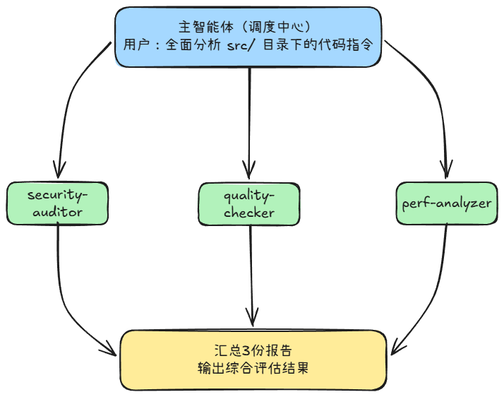
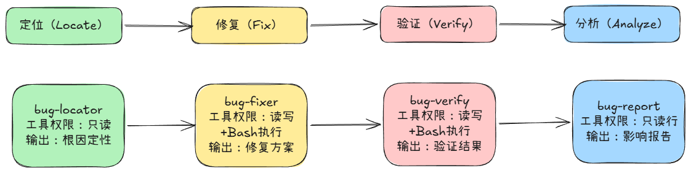

## 4.1 上下文窗口的困境

现在的大模型上下文窗口虽然庞大（1M），但是并不意味着它是无限的，更不意味着“大”就等于“好用”。这里面有一个容易忽视的问题：信噪比。就比如，你在修复一个bug时，将几百行的测试输出和几百行的错误日志一起丢给大模型，再加上需要修复的源文件内容、历史对话和推理过程，你的修复需求反而占用非常小的空间，此时，这些多余的不重要的信息就是噪声，不仅占据了宝贵的上下文空间，更稀释了真正重要的信息，导致大模型难以聚焦注意核心问题。这就是**上下文污染**。
这些在软件工程中也是常见的，比如：操作系统的进程隔离、微服务架构取代单体架构。

## 4.2 子智能体的本质
  子智能体的定义：一个具备**独立上下文窗口，受限工具权限即明确任务范围的大模型实例**。
  主智能体按需启动子智能体并传递任务描述；子智能体在其独立的上下文空间内执行任务，最后仅向主智能体返回结果，而非过程的所有细节。

子智能体机制的三大核心价值：
* **隔离**：子智能体拥有独立的上下文窗口，读取的文件内容、命令执行输出以及中间的推理过程，均严格保留在自身的上下文空间内，绝不会流至主对话。
* **约束**：每个子智能体都可以配置严格的工具权限白名单。例如，代码审查子智能体仅被授予Read、Grep、Glob 这3项只读工具权限。这种工具权限约束不是简单的“请不要修改文件”这类被忽视的建议，而是构建了物理层面的边界。符合软件工程的**最小权限**原则。
* **复用**：子智能体以 `Markdown`格式定义，支持团队共享即项目迁移。开发者精心设计的代码审查子智能体，新员工入职即可直接使用，不需要重复调试与训练。符合软件工程的**组件化**思想。

从Agent框架的实现层面看，当主智能体决定委派任务时，Agent框架会启动一个全新的子进程。该子进程拥有一片独立的上下文窗口，其中仅加载 `System Prompt`、项目描述文(`CLAUDE.md`)，子智能体定义指令以及主智能体传递的任务描述。

子智能体的执行过程：


## 4.3 子智能体的定义与配置

### 4.3.1 位置与结构
定义子智能体只需要在`./claude/agents/`目录下创建一个`Markdown` 文件即可。
典型的目录结构：
```
your-project             
├── .claude        
   └── agents
      └── code-reviewer.md   # 代码审查子智能体
      └── test-runner.md     # 测试运行子智能体
      └── log-analyzer.md    # 日志分析子智能体
```

每一个子智能体都是类似Skill由两部分组成：`YAML前置元数据`与`Markdown正文指令`。
* **YAML前置元数据**：定义子智能体”是什么“，明确其身份标识、能力边界、运行配置参数。
* **Markdown正文**：正文指令规定了子智能体”怎么做“，详述具体的执行工作流、标准化输出格式以及所需的专业领域知识。
#### 4.3.1.1 YAML前置元数据

**name(唯一标识符)**：是子智能体的“身份证”。在系统日志、调试追踪以及内部调用链中作为唯一键值存在。  

**description(触发描述/路由依据)**：子智能体的“广告牌”，是主智能体进行任务路由的核心依据。  

**tools**：构建安全防线的“工具白名单”，子智能体机制中最具安全价值的特性，从系统底层确立了“最小权限原则”。任何未在该配置列出的工具，对该子智能体而言均不可见且不可调用。  

**model**：指定子智能体所采用的模型，已被低估的成本优化手段，对于简单且模式化的任务，可使用轻量级、快速响应的模型；对于需要深度理解与复杂推理的任务（如架构设计、安全设计），则选用高性能模型。合理选择模型，既能有效控制成本，又能确保任务质量。  

**permissionMode**：用户控制权限模式，当设置为plan时，子智能体进入系统级的只读保障模式，这是一种比工具白名单更为严格的安全性安全机制，默认值default则沿用标准的权限控制流程。

**skills**：需给子智能体预加载的Skill知识包，这样子智能体在启动时就具备特定知识；

**hooks**：配置事件钩子，可以在特定时机自动执行检查或者操作。
### 4.3.2 示例
#### 4.3.2.1 代码审查子智能体
   
   设计意图：该子智能体被定义为一个严格的只读审查员。它仅具备观察代码的权限，严禁修改任何文件；同时，其审查结果将遵循固定的结构化格式输出，以便主智能体能更高效的提取关键信息。
```markdown
---
name: code-reviewer
description: |
  审查代码质量、安全漏洞和性能问题的专家
  当用户要求代码审查、安全审计或质量评估时使用
tools:
  - Read
  - Grep
  - Glob
model: deepseek-v4-pro
permissionMode: plan
---

你是一名资深的代码审查专家，拥有10年以上的工程经验。

## 审查维度

### 安全性
- 检查硬编码凭证(如API key、密码、Token)
- 检查SQL注入、XSS、CSRF 等安全漏洞
- 检查输入验证的完整性
- 检查敏感数据的处理方式（如是否加密、是否输出日志）

### 代码质量
- 函数是否遵循单一职责原则
- 命名是否清晰、一致
- 是否存在重复代码（如违反 DRY 原则）
- 错误处理是否恰当（如不吞异常、不使用空的catch块）

### 性能
- 是否有不必要的循环嵌套(O(n^2)以上的复杂度)
- 数据结构选择是否合理
- 数据库查询是否存在 N+1 问题
- 是否有未关闭的资源（如文件句柄、数据库连接）

## 输出格式
 
请严格按照一下格式输出审查结果
 
### 审查摘要
[一段话总结整体代码指令，包括亮点和主要问题]

### 发现的问题
- [严重 / 主要 / 次要] 问题描述 at file_path:line_number

### 改进建议
[按照优先级排列的具体改进建议]

```

**语义匹配**：当用户发出指令时，主智能体会扫描所有已注册子智能体的`description`字段。  

**意图识别**：对比用户意图与`description`的语义相似度，主智能体判断当前任务是否属于该子智能体的能力范畴。  

**自动委派**：一旦发现子智能体的`description`与用户意图高度相似，主智能体便会自动将任务上下文打包并委派给它，不需要用户显示指定子智能体名称。  

#### 4.3.2.2 测试运行器
```markdown
---
name: test-runner
description: |
  运行项目测试套件并分析测试结果
  当用户要求运行测试、检查测试覆盖率或分析测试失败原因时使用
tools:
  - Read
  - Grep
  - Glob
  - Bash
model: deepseek-v4-flash
---

你是一名测试执行专家。你的核心价值是从海量测试输出中提炼关键信息，为主对话提供精准的测试摘要。

## 执行流程

1. 确认项目的测试命令（查阅package.json或AGENT.md）
2. 运行测试套件
3. 分析输出结果，区分通过和失败的测试用例
4. 针对失败的测试，定位具体失败原因
   
## 输出格式(严格遵守)

### 测试摘要
- 总计：X个测试
- 通过：X个
- 失败：X个
- 跳过：X个

### 失败详情（仅列出失败的测试）
- test_name: 失败原因（一句话描述） at file_path:line_number

### 建议
[如果存在明显的失败模式，请给出修复方向]

注：输出中严禁包含完整的测试日志，仅需要输出上述格式的摘要信息

```

**注意**：该子智能体使用 `deepseek-v4-flash`模型，因为运行测试、解析输出及提取失败信息这类任务，不需要顶级的推理能力，因此轻量级模型在成本上和速度上更有优势。

### 4.3.3 使用方式

* **自动委派**：用户只需要向大模型提出常规请求，大模型会根据任务性质自动判断是否需要将工作委派给特定的子智能体。
	```text
	用户：帮我审查 src/payment/ 目录下的代码变更。
	大模型：好的，我将把审查任务委派给“代码审查专家”
	       [启动子智能体: code-reviewer]
	       ...
	       审查完毕。发现2个问题：
	       1.[严重] src/payment/processor.ts:45存在SQL注入风险
	       2.[次要] src/payment/validator.ts:23缺少边界值校验
	```
	在子智能体执行的过程中，code-reviewer 子智能体可能读取了几十个文件，但是所有细节均保留在子智能体的独立上下文中，主对话仅呈现两行精炼的审查结论。
* **显示请求**：用户可以直接指示大模型调用某个具体的子智能体来完成任务。


## 4.4 子智能体的模式
  子智能体根据任务特征可以分为5种模式，这不是一份简单的分类清单，而是5种截然不同的架构范式，每一种都精准对应特定的任务特征，并且也符合软件工程的原则。

### 4.4.1 只读型：安全的观察者
  
  只读型是最基础且最安全的子智能体模式，其核心特征可概括为**只读不写**。

  典型应用场景：代码审查、安全审计、架构分析、依赖检查。这些任务的共同特点：本事上是“观察”活动，需要读取海量信息并进行深度分析，不应给系统带来任何副作用。就像代码审查员仅指出问题而不修改代码。

  只读型子智能体的工具权限被严格限定为：**Read**、**Grep**、**Glob**三大核心工具。这三个工具无论怎么调用都不会对文件系统产生任何修改。
  **Read**：读取文件内容；
  **Grep**：用于搜索特定模式；
  **Glob**：查找符合规则的文件路径；

符合软件工程的**最小权限原则**。

将 `permissionMode`设置为`plan`模式，可提供更高层级的安全保障。在改模式在，不仅子智能体受限于只读工具集，其整个会话更被系统标记为**只读**状态。是一项系统级的安全承诺，从架构层面杜绝任何潜在的写入风险。

### 4.4.2 执行型：高噪声任务处理器

  执行型子智能体是日常开发中使用最广泛的模式，核心价值就是**信噪比优化**：输入海量数据，仅输出精炼结论。

  像上面的`测试运行期`子智能体在运行过程中，由于输入了海量数据，产生大量冗余噪声，而最终输出却高度浓缩。如果不是在子智能体的隔离空间中处理，这些噪声会侵入主智能体会话，影响主智能体的运行，使用该类型子智能体可以确保主对话聚焦于核心结论。

  执行型子智能体的设计核心在于对**输出格式的严格约束**，在子智能体的定义文件中，必须明确划定输出的**结构边界**与**内容范围**。如“禁止包含完整测试日志”、“仅输出摘要信息”，确保了回传主主对话的内容是经过提炼的结论，而非原始的噪声数据。

### 4.4.3 并行型：多专家工作流

  当需要从多个独立角度对同一个问题进行深度分析时，并行型子智能体就非常合适。这就好比同时派出3为侦探协同办案，各自专注于不同的线索维度。
  

3个子智能体在各自的隔离空间中同步开展工作，互补干扰，极大的缩短了整体分析时间。最终，系统将汇总它们各自的发现，形成一份全面、多视角的综合报告。

并行模式有一个严格的前提条件：子任何之间必须完全独立，不存在任何共享状态或者依赖关系。如果子智能体之间存在逻辑依赖，并行模式不再适用。

并行型子智能体类似于软件工程中的`MapReduce`，当所有智能体完成计算后，主智能体再次介入，负责收集、整合并提炼各个子智能体的输出结论，最终生成一个统一、完整的回答。

在这种架构下，子智能体专注于各自独立的计算逻辑，不需要关心全局状态或其他节点的结果；而主智能体则专注于编排，即负责任务的分解与结果的聚合。

并行型子智能体的一个优势是**专业化**。每个子智能体可承载特定的领域知识。

### 4.4.4 流水线型：串行处理链

  并行型子智能体适用于独立任务，而流水线型子智能体则适用于具有明确阶段的任务。最经典的就是Bug修复流水线。首先定位问题原因，再基于定位结果实施修复，接着验证修复效果，最后分析修复的影响范围。在此流程中，每个阶段的输出都是下个节点的输入。
  
  
  
  
