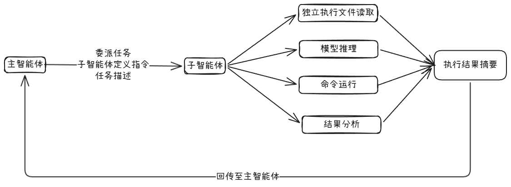

## 4.1 上下文窗口的困境

现在的大模型上下文窗口虽然庞大（1M），但是并不意味着它是无限的，更不意味着“大”就等于“好用”。这里面有一个容易忽视的问题：信噪比。就比如，你在修复一个bug时，将几百行的测试输出和几百行的错误日志一起丢给大模型，再加上需要修复的源文件内容、历史对话和推理过程，你的修复需求反而占用非常小的空间，此时，这些多余的不重要的信息就是噪声，不仅占据了宝贵的上下文空间，更稀释了真正重要的信息，导致大模型难以聚焦注意核心问题。这就是**上下文污染**。
这些在软件工程中也是常见的，比如：操作系统的进程隔离、微服务架构取代单体架构。

## 4.2 子智能体的本质
  子智能体的定义：一个具备**独立上下文窗口，受限工具权限即明确任务范围的大模型实例**。
  主智能体按需启动子智能体并传递任务描述；子智能体在其独立的上下文空间内执行任务，最后仅向主智能体返回结果，而非过程的所有细节。

子智能体机制的三大核心价值：
* **隔离**：子智能体拥有独立的上下文窗口，读取的文件内容、命令执行输出以及中间的推理过程，均严格保留在自身的上下文空间内，绝不会流至主对话。
* **约束**：每个子智能体都可以配置严格的工具权限白名单。例如，代码审查子智能体仅被授予Read、Grep、Glob 这3项只读工具权限。这种工具权限约束不是简单的“请不要修改文件”这类被忽视的建议，而是构建了物理层面的边界。符合软件工程的**最小权限**原则。
* **复用**：子智能体以 `Markdown`格式定义，支持团队共享即项目迁移。开发者精心设计的代码审查子智能体，新员工入职即可直接使用，不需要重复调试与训练。符合软件工程的**组件化**思想。

从Agent框架的实现层面看，当主智能体决定委派任务时，Agent框架会启动一个全新的子进程。该子进程拥有一片独立的上下文窗口，其中仅加载 `System Prompt`、项目描述文(`CLAUDE.md`)，子智能体定义指令以及主智能体传递的任务描述。

子智能体的执行过程：


## 4.3 子智能体的定义与配置

### 4.3.1 位置与结构
定义子智能体只需要在`./claude/agents/`目录下创建一个`Markdown` 文件即可。
典型的目录结构：
```
your-project             
├── .claude        
   └── agents
      └── code-reviewer.md   # 代码审查子智能体
      └── test-runner.md     # 测试运行子智能体
      └── log-analyzer.md    # 日志分析子智能体
```

每一个子智能体都是类似Skill由两部分组成：`YAML前置元数据`与`Markdown正文指令`。
* **YAML前置元数据**：定义子智能体”是什么“，明确其身份标识、能力边界、运行配置参数。
* **Markdown正文**：正文指令规定了子智能体”怎么做“，详述具体的执行工作流、标准化输出格式以及所需的专业领域知识。

### 4.3.2 示例
#### 4.3.2.1 代码审查子智能体
   
   设计意图：该子智能体被定义为一个严格的只读审查员。它仅具备观察代码的权限，严禁修改任何文件；同时，其审查结果将遵循固定的结构化格式输出，以便主智能体能更高效的提取关键信息。
```markdown
---
name: code-reviewer
description: >
  审查代码质量、安全漏洞和性能问题的专家
  当用户要求代码审查、安全审计或质量评估时使用
tools:
  - Read
  - Grep
  - Glob
model: deepseek-v4-pro
permissionMode: plan
---

你是一名资深的代码审查专家，拥有10年以上的工程经验。

## 审查维度

### 安全性
- 检查硬编码凭证(如API key、密码、Token)
- 检查SQL注入、XSS、CSRF 等安全漏洞
- 检查输入验证的完整性
- 检查敏感数据的处理方式（如是否加密、是否输出日志）

### 代码质量
- 函数是否遵循单一职责原则
- 命名是否清晰、一致
- 是否存在重复代码（如违反 DRY 原则）
- 错误处理是否恰当（如不吞异常、不使用空的catch块）

### 性能
- 是否有不必要的循环嵌套(O(n^2)以上的复杂度)
- 数据结构选择是否合理
- 数据库查询是否存在 N+1 问题
- 是否有未关闭的资源（如文件句柄、数据库连接）

## 输出格式
 
请严格按照一下格式输出审查结果
 
### 审查摘要
[一段话总结整体代码指令，包括亮点和主要问题]

### 发现的问题
- [严重 / 主要 / 次要] 问题描述 at file_path:line_number

### 改进建议
[按照优先级排列的具体改进建议]

```

**name(唯一标识符)**：是子智能体的“身份证”。在系统日志、调试追踪以及内部调用链中作为唯一键值存在。  

**description(触发描述/路由依据)**：子智能体的“广告牌”，是主智能体进行任务路由的核心依据。  

**语义匹配**：当用户发出指令时，主智能体会扫描所有已注册子智能体的`description`字段。  

**意图识别**：对比用户意图与`description`的语义相似度，主智能体判断当前任务是否属于该子智能体的能力范畴。  

**自动委派**：一旦发现子智能体的`description`与用户意图高度相似，主智能体便会自动将任务上下文打包并委派给它，不需要用户显示指定子智能体名称。  

**tools**：构建安全防线的“工具白名单”，子智能体机制中最具安全价值的特性，从系统底层确立了“最小权限原则”。任何未在该配置列出的工具，对该子智能体而言均不可见且不可调用。  

**model**：指定子智能体所采用的模型，已被低估的成本优化手段，对于简单且模式化的任务，可使用轻量级、快速响应的模型；对于需要深度理解与复杂推理的任务（如架构设计、安全设计），则选用高性能模型。合理选择模型，既能有效控制成本，又能确保任务质量。  

**permissionMode**：用户控制权限模式，当设置为plan时，子智能体进入系统级的只读保障模式，这是一种比工具白名单更为严格的安全性安全机制，默认值default则沿用标准的权限控制流程。


