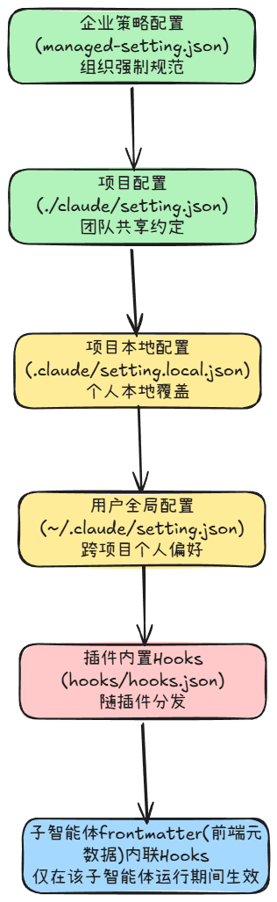
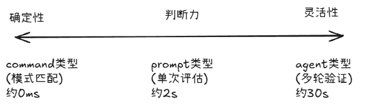

    
    Claude.md 是建议，Skill是指导，但是从来没有人告诉Claude ‘这件事你绝对不能做’。而Hooks不同，它不是建议，而是强制执行。
    Hooks的核心逻辑：在操作执行的前后，插入额外的处理逻辑。

## 5.1  Hooks的定位
 回顾 `Claude.md`、`Skill`、`Agent`，这3种机制的对大模型的影响力是递增的。
 
   **Claude.md**：确定项目规范，有Claude在每次对话启动是读取；
   **Skill**：封装领域工作流，可在Claude需要自动或者手动触发；
   **Agent**：通过隔离上下文实现任务委派；

这3种机制的有一个共同特征：均作用于Claude的认知层面，`Claude.md`告诉Claude”应遵守何种规范“，`Skills`指导Claude"遇到此类问题时如何处理"，`子智能体`则指示Claude”应将子任务委派给谁“。当然，这些都仅仅只是建议性指导。但是作为语言模型，Claude在理论上可以忽略任何Prompt中的约束能力。

Hooks 的工作层面与前3着截然不同，作用与Claude的系统执行层，直接在系统执行层拦截Claude行为。例如，在Claude 尝试调用`rm -rf /`时，Hooks可以在系统执行层直接阻断该工具调用的执行，而不是像前3者”劝说“Claude不要执行该工具调用。

`Claude.md`与`Skills`定义的是策略，即应该怎么做，而`Hooks`定义的是机制，即”一旦违反策略，将被物理禁止“。`Hooks`对Claude的约束也不再依赖于Prompt的”引导“，而是通过系统底层的强制力来保障执行。

| 机制        | 工作层面  | 触发方式      | 约束性质 | 对Claude的控制 | 类比     |
| --------- | ----- | --------- | ---- | ---------- | ------ |
| Claude.md | 认知层   | 始终加载      | 建议   | 引导其行为      | 交通标志   |
| Skills    | 认知层   | 语义匹配/显示触发 | 指导   | 规范工作流      | 驾驶手册   |
| Hooks     | 系统执行层 | 事件自动触发    | 强制   | 拦截/阻止      | 路障/限速器 |
  
## 5.2 事件生命周期
  
  Claude Code的事件系统目前内置了多个事件，覆盖AI会话从启动到终止、从主对话到子智能体协作的完整生命周期。主要分为：会话级事件，工具调用事件、子智能体事件、完成事件与较新的事件类型。
### 5.2.1 会话级事件

会话级事件负责管理整个会话的生命周期，主要包含一下3个关键事件：

#### 5.2.1.1 SessionStart 事件

在会话启动或者恢复时触发。核心能力是通过`CLAUDE_ENV_FILE`注入环境变量。Hook脚本可向该文件写入 `export`语句，使变量在后续所有的Bash命令中生效。这就意味着可以在会话开始是自动配置开发环境。

   ```shell
   #!/bin/bash
   # session-init.sh  —— SessionStart Hook
   if [ -n "$CLAUDE_ENV_FILE" ]; then
       echo 'export NDOE_ENV=development' >> "$CLAUDE_ENV_FILE"
       echo 'export DEBUG_LOG=true' >> "$CLAUDE_ENV_FILE"
   fi
   exit 0
   ```

#### 5.2.1.2 SessionEnd 事件

在会话终止时触发。其匹配器（matcher）可以区分不同的终止原因：`clear(用户清除)`、`logout(登出)`、`prompt_input_exit(用户退出输入)`。该事件常用于清理临时资源或者记录会话统计信息。

#### 5.2.1.3 PreCompoct 事件

在上下文压缩前触发。其匹配器可以区分`manual(用户主动执行/compact指令)`和`auto(上下文窗口满后自动压缩)`。此事件适合在压缩前备份完整的对话记录。

### 5.2.2 工具调用事件

    最核心的事件类别，涵盖了Claude每次工具调用的完整生命周期。
#### 5.2.2.1 PreToolUse 事件
    
    整个Hooks系统中最强大的事件。

在Claude决定调用某个工具之后，工具实际执行之前触发。该事件支持3中操作：
* **允许（allow）**：绕过权限检查直接执行；
* **拒绝（deny）**：阻止执行并说明原因；
* **修改（updateInput）**：调整输入参数后执行；

“调整输入参数”这个操作的能力尤其强大：允许在不中断操作的前提下，静默地为命令添加安全参数。例如如下示例，将原本危险的`rm -rf`操作静默修改为`rm -rf --dry-run`，既让Claude继续完成任务，又避免了文件被真正删除。 
```json
{
  "hooksSpecificOutput": {
    "hooksEventName": "PreToolUse",
    "permissionDecision": "allow",
    "updateInput": {
	    "command": "rm -rf /tmp/test --dry-run"
    }
  }
}
```

#### 5.2.2.2 PostToolUse 事件

在工具执行成功后触发。它无法撤销已经发生的操作，但是具备两项核心功能：
* 通过 `additionalContext`向Claude反馈额外信息（如代码Lint检查结果）;
* 对输出进行后处理，如自动格式化刚写入的文件。

另外，在MCP场景中，该事件还拥有专属能力：可通过`updatedMCPToolOutput`字段直接替换MCO工具的原始输出内容。

#### 5.2.2.3 PostToolUseFailure 事件

在工具执行执行失败后触发，主要用于错误告警以及提供纠正性反馈。

#### 5.2.2.4 PermissionRequest 事件

在权限对话框即将弹出时触发。他与 `PreToolUse`的关键区别在于触发时机，`PreToolUse`会在每次工具调用前无条件触发，`PremissionRequest`仅在Claude需要用户手动确认确认权限时才被激活。通过该事件，可以通过编程方式自动批准或者拒绝权限申请。
```json
{
  "hooksSpecificOutput": {
    "hooksEventName": "PermissionRequest",
    "decision": {
	    "behavior": "allow",
	    "updatedPermissions": {}
    }
  }
}
```

#### 5.2.2.5 UserPromptSubmit 事件

在用户提交输入后，Claude 开始处理之前触发。该事件常用语输入预处理或者上下文注入场景。例如：在用户每次发送消息时，自动附加当前的Git分支信息。

### 5.2.3 子智能体事件
#### 5.2.3.1  SubagentStart 事件

在子智能体启动时触发，其匹配器可以根据子智能体的类型名称进行筛选，既支持内置类型（如：Bash、Explore、Plan），也支持 `.claude/agents`目录中定义的子智能体。记住，SubagentStart事件无法阻止子智能体的启动，但在子智能体运行时会通过 `additionalContext`注入关键上下文信息。例如，在子智能体自动时，自动加载团队的编码规范。

#### 5.2.3.2 SubagentStop 事件

在子智能体完成任务后触发。其行为与全局的`Stop事件`完全一致，也可以放行停止操作，也可以拦截该请求，强制子智能体继续工作，直到满足特定的指令标准。此外，`SubagentStop`的输入数据包含两个关键路径：
* transcript_path：主会话记录；
* agent_transcript_path：子智能体自身的对话记录；
借助这些信息，Hooks脚本能够复盘子智能体的完整工作流程，从而对其产出质量进行精准评估。

### 5.2.4 完成事件
#### 5.2.4.1 Stop 事件

在Claude完成整轮响应时触发。这是实现”质量门控“机制的核心：如果检测到输出内容未满足预设标准，可以通过设置`decision: "block"`阻止会话结束，强制 Claude继续修正或者完善工作。

#### 5.2.4.2 Notification 事件

在Claude发送系统通知时触发。其匹配器能够精准区分不同类型的通知，如：`permission_prompt(权限请求)`、`idle_prompt(空闲提示)`、`auth_success(认证成功)`等。该事件常用于自定义通知渠道的集成，例如：将关键告警在本地桌面触发弹窗提醒。

### 5.2.5 新的事件

#### 5.2.5.1 TeammateIdle 事件

专为多智能体团队协作设计。在队友智能体即将进入空闲状态时触发。

#### 5.2.5.2 TaskCompleted 事件

专为多智能体团队协作设计。在任务被标记完成时触发。

#### 5.2.5.3 ConfigChange 事件

在配置文件发生变更时触发。该事件主要用于审计与合规，帮助开发者追踪设置变化历史，防止未经授权的配置修改。

#### 5.2.5.4.  WorktreeCreate 事件

对应 GitWorktree 的创建，通过拦截该事件，用户可以自定义版本控制工作流的初始化操作，如：自动安装依赖。

#### 5.2.5.5 WorktreeRemove 事件

对应 GitWorktree 的删除，通过拦截该事件，用户可以自定义版本控制工作流的清理逻辑，如：删除临时构建产物。

### 5.2.6 "能否阻止"：最关键的维度

在所有的Hooks 时间中，“能否阻止”是最核心的分类维度，它决定了事件是用于“控制流程”还是仅用于“观察记录”。

具备阻止能力的事件包括：
* PreToolUse
* PermissionRequest
* UserPrompt
* Stop
* SubagentStop
* TeammateIdle
* TaskCompleted
* ConfigChange
* WorktreeCreate

只读事件：
* PostToolUse
* Notification
* SubagentStart
只读事件主要用于读取上下文。注入而外的信息或者触发侧边效应（如发送通知），但无法阻止或者修改Claude的核心执行逻辑。

最常用的3个事件：PreToolUse(工具执行前的守门员)、PostToolUse(工具执行后的质量守卫)、Stop(任务完成时的质量门控)，通过这3个事件，即可构建出健壮的自动化闭环。

## 5.3 配置体系：6个位置，6种用途

Claude Code 的配置系统采用分层叠加机制，优先级从上至下依次降低。Hooks 的配置采用标准的JSON格式，并严格遵循六层优先级架构。这种设计允许开发者根据作用域灵活部署自动化逻辑。
<div align=center></div>


`.claude/setting.json`是团队协作的核心载体。所有成员在拿到项目时即可自动同步团队的的配置。
`./claude/setting.local.json`适用于需要覆盖团队默认配置的个人场景。
`~/.claude/setting.json`则用于管理跨项目的个人偏好。

`setting.json`采用3层嵌套设计：事件类型 -> match组 -> Hooks处理器列表，例如：
```json
{
    "hooks": 
    {
        "PreToolUse": [
	        {
                "match": "Bash",
                "hooks": [
                    {
                        "type": "command",
                        "command": "./.claude/hooks/block-dangerous.sh",
                        "timeout": 30
                    }
                ]
            }
        ],
        "PostToolUse": [
	        {
                "matcher": "Write|Edit",
                "hooks": [
	                {
                        "type": "command",
                        "command": "prettier --write  \"$CLAUDE_FILE_PATH\""
                    }
                ]
            }
        ]
    }
}
```

matcher字段用于指定该组Hook适用的工具范围。
* Bash：匹配所有的 Bash 调用
* Write|Edit：匹配 Write或者Edit工具调用（管道符 | 表示逻辑 “或”）
* * ： 匹配所有工具
对于Stop、Notification、UserPromptSubmit 等生命周期，matcher字段将被忽略，因为这些事件不针对特定工具。而在 SubagentStart 或者 SubagentStop事件中，matcher 匹配的是子智能体类型名称，而非工具名称。

## 5.4 三种处理器类型：确定性的阶梯

Hook 处理器包含3种类型，构成了一个”确定性递减、灵活性递增“的阶梯。具体的选择取决于验证逻辑所需的判断力度。

### 5.4.1 command类型：确定性规则

该类型用于执行Shell命令或者脚本。作为最常用且最可靠的的类型，确定性规则永远比大模型的判断更为可信。例如：
```json
{
	"type": "command",
	"command": "./.claude/hooks/check-security.sh",
	"timeout": 30
}
```

`command`类型的Hook通过标准输入（stdin）接收JSON格式的上下文数据（包含session_id、tool_name、tool_input等），通过标准输出(stdout)输出JSON格式的决策，并依据退出码表达最终意图。
* 退出码 0：表示成功。系统将 stdout 种的JSON解析结果作为决策依据；
* 退出码 2：表示有意阻止。系统将 stderr 的内容作为错误原因反馈给 claude；
* 其他退出码：表示脚本异常。stderr 内容仅在调试模式下可见，但不会阻断主流程。

退出码 2 的设计至关重要，它严格区分了“有意阻止操作”与“脚本异常”。脚本异常不应阻碍正常工作流。

### 5.4.2 prompt类型：单词大模型评估

当验证逻辑需要一定的判断力，但不需要执行多步操作时，建议使用 `prompt`类型。该类型会调用小型的模型（通常为Haiku）对当前情况进行评估。例如：
```json
{
	"type": "prompt",
	"prompt": "评估这段代码修改是否引入了安全漏洞。$ARGUMENTS",
	"model": "claude-haiku-4-5",
	"timeout": 30
}
```

其中 $ARGUMENTS为占位符，运行时将被替换为Hook接收到完整输入JSON。大模型的响应需要遵循以下JSON格式。
* 允许通过的JSON格式：
```json
{"ok": true, "reason":"代码修改安全，未引入已知漏洞模式"}
```
* 拒绝操作的JSON格式：
```json
{"ok": false, "reason":"检测到潜在的SQL注入风险：用户输入未经转义直接拼接到查询字符串"}
```

### 5.4.3 agent 类型：多轮子智能体验证
 
当验证逻辑需要实际查看代码文件、执行搜索或者多步操作才能得出结论时，应使用`agent`类型。该类型会启动一个子智能体，以便能够利用 Read、Grep、Glob 等工具进行多轮深度验证， 例如：
```json
{
	"type": "agent",
	"prompt": "检查所有修改的文件是否通过了单元测试。运行测试套件并验证结果。$ARGUMENTS",
	"timeout": 30
}
```

`agent` 类型的子智能体最多运行50轮对话/操作后必须返回决策，其响应格式与 `prompt`类型完全一致。

**总结**:
选择Hook处理器类型时，应遵循”能用`command`类型的不用`prompt`类型，能用 `prompt`类型的不用`agent`类型“的降级原则。

  

确定性规则（如模式匹配、文件名检查、正则表达式）在速度和可靠性上永远大于大模型判断。只有当验证逻辑确实需要”理解力（语义分析）“或者”检查代码能力（多文件上下文检索）“时，才考虑升级到`prompt`或者`agent`类型。

## 5.5 hookSpecificOupt：与Claude交流的协议

Hook的输出格式使用嵌套在 `hookSepcificOutput`对象中的`permissionDecision`格式。例如：
```json
{
  "hooksSpecificOutput": {
    "hooksEventName": "PreToolUse",
    "permissionDecision": "deny",
    "permissionDecisionReason": "此命令试图删除受保护的系统目录",
    "additionalContext": "受保护的路径模式: /etc, /usr, /var"
  }
}

```

`permissionDecision`支持以下3种值：
* allow：绕过权限系统直接执行
* deny：阻止执行
* ask：交由用户确认（该选项并非自动拒绝，而是表达“我不确定，请有人来决定”的态度）
*
`additionContext`字段适用于所有事件类型，其内容将被注入 Claude 的上下文中。这一机制构建了一个高效的反馈闭环。例如`PostToolUse`Hook 可以通过`additionContext`将代码静态分析结果反馈给Claude，Claude 再接收到这些信息后会自动修复问题，整个过程不需要人工干预。

另外，所有事件均支持一下几个通用的顶层字段：
```json
{
	"continue": false,
	"stopReason": "检测到安全违规，会话已中止",
	"suppressOutput": false,
	"systemMessage": "警告，此操作已被安全策略拦截"
```

* `continue=false`：相当于“紧急制动 ”。无论当前处于何种事件节点，该设置都会立即终止 Claude 的处理；
* `systemMessage`：该字段的内容将直接显示给用户，而不会传递给 Claude。


## 5.6 工程实战一：安全防护体系

使用Hooks构建一套完整的安全防范体系，通过以下3道防线进行安全防护。
* 危险命令拦截：block-dangerous
* 敏感文件保护：
* 全量操作审计：

### 5.6.1 PreToolUse：危险命令拦截

该Hook 的目的是拦截可能引发灾难的 Bash 命令。设计细节：
* 调试信息输出值标准错误（如：stderr，即 >&2）,而非标准输出（stdout）。这是因为 stdout必须严格保留用于输出JSON格式的决策结果。
* 使用 jq 工具解析输入的JSON数据，避免了脆弱的手动字符串匹配。
* 每一次拦截操作都附带清晰、具体的原因说明。
```shell
#!/bin/bash
# ./claude/hooks/block-dangegous.sh
set -e
INPUT=${cat}
# 提取命令（调试信息输出值 stderr）
COMMAND=$(echo "$INPUT" | jq -r '.tool_input.command' // ""')
echo "DEBUG: Checking command: $COMMAND" >&2
# 危险命令模式列表
DANGEROUS_PATTERNS=(
  "rm -rf /"
  "rm -rf ~"
  "rm -rf \$HOME"
  "> dev/sd"
  "mkfs."
  ":(){:|:&};:"  # fork bomb（Fork 炸弹）
  "chmod -R 777 /"
  "git push --force origin main"
  "git push --force origin master"
  "git reset --hard origin"
  "DROP DATABASE"
  "DROP TABLE"
  "TRUNCATE"
  "curl.* | bash"
  "curl.* | sh"  # 危险的管道执行
)

for pattern in "${DANGEROUS_PATTERNS[@]}"; do
  if [[ "$COMMAND" == *"$pattern"* ]]; then
    echo "BLOCKED: Dangerous command detected: '$COMMAND'" >&2
    cat <<EOF
{
    "hookSpecificOutput":{
        "hookEventName": "PreToolUse",
        "permissionDecision": "deny",
        "permissionDecisionReason": "Dangerous command detected: '$COMMAND'"
        }
}
EOF
    exit 2
  fi
done
echo '{"hookSpecificOutput":{"hookEventName": "PreToolUse","permissionDecision": "allow"}}'
exit 0
```

### 5.6.2 PreToolUse：敏感文件保护

该Hook的目的是保护敏感文件免受意外修改。该Hook的匹配器配置为`Write|Edit`。确保仅在发生文件写入或者编辑操作时才触发。
```shell
#!/bin/bash

# ./claude/hooks/protect-files.sh

set -e
INPUT=${cat}

FILE_PATH=$(echo "$INPUT" | jq -r '.tool_input.file_path' // ""')
if [ -z "$FILE_PATH" ]; then
  echo '{"hookSpecificOutput":{"hookEventName":"PreToolUse","permissionDecision":"allow"}}'
  exit 0
fi

FILENAME=$(basename "$FILE_PATH")

# 受保护的文件名模式

PROTECTED_FILES=(
  ".env"
  ".env.local"
  ".env.production"
  "credentials.json"
  "secrets.yaml"
  "secrets.yml"
  "secrets.json"
  "id_rsa"
  "id_ed25519"
)

# 受保护的扩展名
PROTECTED_EXTENSIONS=(
  "pem"
  "key"
  "crt"
  "p12"
  "pfx"
)      

# 受保护的目录
PROTECTED_DIRS=(
  ".git"
  ".ssh"
  ".node_modules"
)

# 检查目录
for dir in "${PROTECTED_DIRS[@]}"; do
  if [[ "$FILE_PATH" == *"$dir"* ]]; then
    echo "BLOCKED: Attempt to access protected directory: '$FILE_PATH'" >&2
    cat <<EOF
{
    "hookSpecificOutput":{
        "hookEventName": "PreToolUse",
        "permissionDecision": "deny",
        "permissionDecisionReason": "不允许修改受保护目录中的文件: $dir"
        }
}  
EOF
    exit 2
  fi
done


# 检查文件名
for name in "${PROTECTED_FILES[@]}"; do
  if [[ "$FILENAME" == "$name" ]]; then
    echo "BLOCKED: Attempt to access protected file: '$name'" >&2
    cat <<EOF
{
    "hookSpecificOutput":{
        "hookEventName": "PreToolUse",
        "permissionDecision": "deny",
        "permissionDecisionReason": "不允许修改受保护文件: $name"
        }
}
EOF
    exit 2
  fi
done

# 检查扩展名
EXT = "${FILENAME##*.}"
for ext in "${PROTECTED_EXTENSIONS[@]}"; do
  if [[ "$EXT" == "$ext" ]]; then
    echo "BLOCKED: Attempt to access protected file with extension: '$EXT'" >&2
    cat <<EOF
{
    "hookSpecificOutput":{
        "hookEventName": "PreToolUse",
        "permissionDecision": "deny",
        "permissionDecisionReason": "不允许修改受保护扩展名的文件: .$ext"
    }
}
EOF
    exit 2
  fi
done

echo '{"hookSpecificOutput":{"hookEventName":"PreToolUse","permissionDecision":"allow"}}'
exit 0
```


### 5.6.3 PostToolUse：全量操作审计

该hook通过配置`matcher:"*"`,使得其能够捕获并记录所有的工具调用。在合规性要求严格的企业环境中，这是不可获取的机制。
```shell
#!/bin/bash
# ./claude/hooks/audot-log.sh

INPUT=${cat}
LOG_DIR="${CLAUDE_PROJECT_DIR:-.}/.claude/logs"
mkdir -p "$LOG_DIR"
LOG_FILE="$LOG_DIR/audit-$(date +%Y-%m-%d).log"
TIMESTMAP=$(date -Iseconds)
TOOL_NAME=$(echo "$INPUT" | jq -r '.tool_name // "unknown"')
TOOL_INPUT=$(echo "$INPUT" | jq -c '.tool_input // {}')

echo "[$TIMESTMAP] $TOOL_NAME: $TOOL_INPUT" >> "$LOG_FILE"
echo "{}"
exit 0
```

### 5.6.4 完整配置

将`5.6.1~5.6.3`对应的3个hook脚本整合进`.claude/settings/json`，就形成了一套严密的纵深防御体系.
```json
{
  "hooks": {
    "PreToolUse": [
      {
        "matcher": "Bash",
        "hooks": [
          {
            "type": "command",
            "command": "./.claude/hooks/block-dangerous.sh"
          }
        ]
      },
      {
        "matcher": "Write|Edit",
        "hooks": [
          {
            "type": "command",
            "command": "./.claude/hooks/protect-files.sh"
          }
        ]
      }
    ],
    "PostToolUse": [
      {
        "matcher": "*",
        "hooks": [
          {
            "type": "command",
            "command": "./.claude/hooks/audit-log.sh"
          }
        ]
      }
    ]
  }
}
```

这套配置构建了一个涵盖“事前拦截、事中防护、事后审计”的完整安全闭环。


## 5.7 工程实战二：代码质量自动化

安全防护是”防患于未然“，但是代码质量则侧重于”确保卓越交付“。

### 5.7.1 PostToolUse：自动格式化

每次Claude写入文件后，系统自动触发格式化工具。使用该工具，Claude模型不需要感知项目具体采用何种格式化规范，只需要专注代码逻辑。
```shell
#! /bin/bash
# .claude/hooks/auto-format.sh

set -e
INPUT=${cat}
FILE_PATH=$(echo "$INPUT" | jq -r '.tool_input.file_path' // ""')
if [ -z "$FILE_PATH" ] || [ ! -f "$FILE_PATH" ]; then
  echo '{}'
  exit 0
fi  

EXTENSION="${FILE_PATH##*.}"
case "$EXTENSION" in
    js|jsx|ts|tsx|json|md|css|scss|html|vue)
        if command -v npx >/dev/null 2>&1; then
            npx prettier --write "$FILE_PATH" 2>/dev/null
            echo '{"hookSpecificOutput":{"additionalContext":"已用 Prettier 格式化"}}'
        fi
        ;;
    py)
        if command -v black &> /dev/null; then
            black "$FILE_PATH" 2>/dev/null
            echo '{"hookSpecificOutput":{"additionalContext":"已用 Black 格式化"}}'
        fi
        ;;
    go)
        if command -v gofmt &> /dev/null; then
            gofmt -w "$FILE_PATH" 2>/dev/null
            echo '{"hookSpecificOutput":{"additionalContext":"已用 gofmt 格式化"}}'
        fi
        ;;
    *)
        echo '{}'
        ;;
esac
exit 0
```

脚本中引入了`command -v`进行环境检查。如果检测到格式化工具未安装，Hook将静默跳过而非抛出错误。这体现了”优雅降级“的设计原则：Hook自身的异常不应该阻塞核心工作流的正常运行。

### 5.7.2 PostToolUse：Lint反馈循环

Lint 检查可以保证代码的”正确“，利用`additionalContext`将Lint检查结果反馈给Claude，从而构建起”修改—>检查—>反馈—>修复“的自动化闭环

```shell
#! /bin/bash
# .claude/hooks/lint-check.sh

set -e
INPUT=${cat}
FILE_PATH=$(echo "$INPUT" | jq -r '.tool_input.file_path' // ""')
if [["$FILE_PATH" == *.js || "$FILE_PATH" == *.jsx || "$FILE_PATH" == *.ts || "$FILE_PATH" == *.tsx || "$FILE_PATH" == *.json || "$FILE_PATH" == *.css || "$FILE_PATH" == *.scss || "$FILE_PATH" == *.html || "$FILE_PATH" == *.vue ]]; then
    LINT_RESULT=$(npx eslint --fix "$FILE_PATH" 2>&1) || true
    if [ $? -ne 0 ]; then
        ESCAPED=$(echo "$LINT_RESULT" | head -30 | jq -Rs '.')
        echo "{\"hookSpecificOutput\":{\"additionalContext\":\"ESLint 发现问题 \n${ESCAPED}\"}}"
    else
        echo '{"hookSpecificOutput":{"additionalContext":"ESLint 检查通过"}}'
    fi
else
    echo "{}"
fi
```

当Claude完成JavaScript/TypeScript 文件的修改后，如果触发Lint错误，脚本自动将错误详情注入到 `additionalContext`。Calude读取到该上下文后，将自动分析并修复问题。整个流程不需要人工干预，实现了从代码生成到质量达标的全自动迭代。

### 5.7.3 Stop Hook：测试指令门控

`Stop` Hook是质量保证的一道防线：当Claude宣称任务完成是，自动触发测试套件。如果测试失败，系统将阻止绘画结束并强制要求继续修复。
```shell
#! /bin/bash
# .claude/hooks/run-tests.sh
set -e
INPUT=${cat}

# 【关键机制】阻止无限循环：检查 stop_hook_active 标志
# 如果该标志为true，说明已经重试过一次，本次必须放行以避免死锁
STOP_ACTIVE=$(echo "$INPUT" | jq -r '.stop_hook_active // false')
if [ "$STOP_ACTIVE" == "true" ]; then
    exit 0 # 终止拦截，允许claude停止
fi

# 切换到项目目录
if [ -n "$CLAUDE_PROJECT_DIR" ]; then
    cd "$CLAUDE_PROJECT_DIR"
fi  

#检查项目类型并运行测试
TEST_PASSED=true
TEST_RESULT=""
if [ -f "package.json" ] && grep -q '"test"' package.json; then
    TEST_RESULT=$(npm test 2>&1) || TEST_PASSED=false
elif [ -f "pyptoject.toml" ] || [ -f "pytest.ini" ]; then
    TEST_RESULT=$(pytest 2>&1) || TEST_PASSED=false
elif [ -f "go.mod" ]; then
    TEST_RESULT=$(go test ./... 2>&1) || TEST_PASSED=false  
else
    echo '{"hookSpecificOutput":{"additionalContext":"未检测到已配置的测试框架，跳过测试"}}'
    exit 0
fi
  
if [ "$TEST_PASSED" = true ]; then
    echo '{"hookSpecificOutput":{"additionalContext":"所有测试通过"}}'
else
    # 截取前50行错误日志并转义
    TEST_ESCAPED=$(echo "$TEST_RESULT" | head -50 | jq -Rs '.')
    # 返回 block决策，强制claude继续工作
    cat <<EOF
{  
"decision": "block",
"reason": "测试失败，请修复后再停止",
"hookSpecificOutput": {
        "additionalContext":${TEST_ESCAPED}
    }
}
EOF
fi
exit 0
```

`stop_hook_active`字段不是防止系统陷入“死循环”的关键，其逻辑类似于递归函数的终止条件。当 Stop Hook执行失败时，若系统尝试修复并再次触发该Hook，stop_hook_active 将被设置为true。随后，脚本检测到该标志就放行，从而退出循环。就像递归函数必须设定终止条件，Stop Hook 也必须具备明确的退出机制。
## 5.8 子智能体 Hooks：精准的上下文管理

子智能体通过隔离上下文来实现任务委派。Hooks系统为此提供两种专属事件`SubagentStart`和`SubagentStop`。然后，更为关键的是第三种机制：直接在子智能体的`Frontmatter`中定义Hooks。

### 5.8.1 全局与 Frontmatter：精度问题

假如我们有一个名为 `db-reader`的子智能体，用于执行SQL查询。如果需要审查这个子智能体执行的每一条 Bash 命令来防止SQL注入风险，在全局的 `setting.json`中配置Hook并非最佳方案。因为全部配置会无差别·的拦截所有 Bash 命令，这样容易浪费系统性能，引发误拦截。所有，更优的方案实在子智能体的Frontmatter 中定义 Hook。
```markdown
---
name: db-reader
description: 只读数据库分析工具
tools: Read,Grep,Glob,Bash
hooks:
  PreToolUse:
    - matcher: "Bash"
      hooks:
        - type: command
          command: "./.claude/hooks/check-sql-injection.sh"
  Stop:
    - hooks:
        - type: prompt
          prompt: "检查查询结果是否包含PII(如姓名、邮箱、手机号)。如果包含，请回复ok:false，并要求进行脱敏处理"
---
你是一名数据库分析专家。仅执行SELECT查询，严禁执行任何修改数据的SQL语句。
```

采用 Frontmatter 定义 Hook的核心优势在于生命周期紧密绑定：Hook随智能体的启动而激活，并在完成任务后自动清理。此外，配置与子智能体定义集成与同一文件中，可随 md 文件一同分发，用户不需要额外修改全局 setting.json。

### 5.8.2 SubagentStart：自动注入上下文

SubagentStart Hook的典型应用实在子智能体启动时动态注入团队规范。例如，每当启动 code-reviewer 子智能体时，系统可自动注入团队的编码标准。
```json
{
	"hooks": {
		"SubagentStart": [
			{
				"mather": "code-reviewer",
				"hooks": [
					{
						"type": "command",
						"command": "echo '\"hookSepcificOutput\":{\"hookEventName\": \"SubagentStart\", \"additionalContext\":\"团队编码规范：使用 camelCase命名,行长上限100个字符，公共API必须包哈JSDoc注释\"}}'"
					}
				]
			}
		]
	}
}
```

### 5.8.3 SubagentStop：验证输出质量

SubagentStop Hook 可用于验证子智能体的工作成功是否达标。通过结合 `agent_transcript_path`读取子智能体的完整交互记录，系统能执行细粒度的质量验收。

```shell
#! /bin/bash
# .claude/hooks/verify-review-quality.sh
INPUT=${cat}
AGENT_TYPE=$(echo "$INPUT" | jq -r '.agent_type')
STOP_ACTIVE=$(echo "$INPUT" | jq -r '.stop_hook_active')

# 仅验证 code-review 子智能体
if [ "$AGENT_TYPE" != "code-reviewer" ]; then exit 0; fi

# 防止死循环（若当前已是 Stop Hook触发阶段，则跳过）
if [ "$STOP_ACTIVE" == "true" ]; then exit 0; fi

TRANSCRIPT=$(echo "$INPUT" | jq -r '.agent_transcript_path')
if [ -f "$TRANSCRIPT" ]; then
    HAS_ISSUES=$(grep -c "issue\|问题\|bug" "$TRANSCRIPT" || true)
    HAS_SUGGESTIONS=$(grep -c "suggest\|建议\|recommend" "$TRANSCRIPT" || true)
    if [ "$HAS_ISSUES" -gt 0 ] && [ "$HAS_SUGGESTIONS" -eq 0 ]; then
        echo '{"decision":"block","reason":"代码审查中发现了问题但未提供修复建议，请补充每个问题的改进方案"}'
        exit 0
    fi
fi
exit 0
```


* Frontmatter Hook：负责内部自检，确保自智能自问“我的输出是否完整”
* SubagentStart Hook：负责外部注入，在启动是赋予其必要的上下文
* SubagentStop Hook：负责外部验收，在结束时严格核查“它的工作成功是否达标”

## 5.9 异步Hooks：后台执行不阻塞

 默认情况下，Hook脚本的执行是同步阻塞的，Claude会暂停当前工作流，直至脚本执行完毕并返回结果。对于运行测试套件、调用外部API等耗时操作，同步阻塞会显著拖慢Claude的响应速度。

通过`"async": true`可以让Hook再后台非阻塞执行。Claude 不需要等待期完成即可立即继续后续工作。当异步的 Hook 执行完毕后，其输出结果将再下一轮对话轮次中自动传递给Claude，工期参考或者处理。

异步 Hook 的限制：
* 类型限制：仅 `command`类型的 Hook 支持异步执行。 `prompt`和`agent`类型的 Hook 必须同步执行；
* 拦截能力限制：异步 Hook 无法阻止当前操作，由于主流程在Hook启动的瞬间即已继续执行，异步Hook 失去了在操作发生前进行干预的时机。

因此，异步 Hook 适用于日志记录、异步通知、后台数据验证、非关键性质量审计等“事后处理”的任务，不适用于需要实时阻断的安全审查。

## 5.10 环境变量与调试

### 5.10.1 Hooks可用的环境变量

| 环境变量               | 作用域           | 核心用途                     |
| ------------------ | ------------- | ------------------------ |
| CLAUDE_PROJECT_DIR | 所有Hook        | 获取当前项目的根目录绝对路径           |
| CLAUDE_SESSION_ID  | 所有Hook        | 当前会话的唯一标识符               |
| CLAUDE_TOOL_NAME   | 所有Hook        | 触发当前Hook的工具名称            |
| CLUADE_FILE_PATH   | 所有Hook        | 当前操作涉及的文件绝对路径<br>（若适用）   |
| CLAUDE_ENV_FILE    | 仅SessionStart | 环境变量持久化文件的路径             |
| CLAUDE_NOTICATION  | 仅Notification | 包含具体的通知消息内容              |
| CALUDE_CODE_REMOTE | 所有Hook        | 布尔值标识<br>指示是否在远程Web环境中运行 |
| CLAUDE_PLUGIN_ROOT | 仅Plugin Hook  | 插件安装的根目录路径               |

### 5.10.2 调试 “三板斧”

调试 Claude Hook 脚本的3中核心方法：
* 将调试信息输出到 stderr
	由于stdout专用于输出JSON决策结果，所有调试信息必须重定向值stderr。
	```shell
	echo "DEBUG: Checking file $FILE_PATH" >&2  # 调试信息
	echo '{"decision": "allow"}' # JSON决策
	```
* 手动测试 Hook 脚本
	通过构造模拟输入直接验证脚本逻辑
	```shell
	echo '{"tool_name": "Bash", "tool_input": {"command": "rm -rf /"}}' | ./.claude/hooks/block-dangrous.sh
	echo "Exit code: $?"
	```
* 使用 `claude --debug`查看完整的Hook执行细节
	调试模式将显示匹配的Hook列表、各脚本的执行耗时和返回结果。

### 5.10.3 常见陷阱

在使用 Hooks 的过程中，有2个经常被忽视的问题：
* 问题1：若Shell配置文件（如：~/.zhsrc或~/.bashrc）包含无条件的`echo`语句（如用于输出欢迎信息），这些输出内容会污染标准输出（stdout），从而导致JSON解析失败。解决方式：使用 `[[ $- == *i*]]` 条件将这些 `echo`语句包裹起来，确保他们仅在交互Shell中执行。
* 问题2：直接边界 setting.json 后，Hook 往往不会立即生效。这是因为 Claude Code 仅在启动时捕获配置快照，运行期间对文件的修改不会自动同步。如需要生效，用户需要在 `/hooks` 菜单中确认变更或者重启当前会话。

## 5.11 工程设计方法论

面对具体的自动化需求，设计Hook方案需要明确一下3个核心维度。

* 拦截时机（事件选择）：
	* 操作前拦截：选用`PreToolUse`或者`UserPromptSubmit`；
	* 操作后拦截：选用 `PostToolUse`；
	* 完成时检查：选用`Stop`或者`SubagentStop`;
	* 生命周期管理：选用`SessionStart`或者`SessionEnd`；
* 判断方式（类型选择）：
	* 规则明确（如模式匹配、文件检查）：选用 `command`类型；
	* 需要语义判断但输入充分：选用`prompt`类型；
	* 需要深度代码分析：选用`agent`类型；
* 配置作用域（位置选择）：
	* 团队通用规范：配置于 ./claude/setting.json；
	* 个人偏好设备：配置于 ~/.claude/setting.json；
	* 子智能体专属检查：配置于子智能体的 `Frontmatter`；

设计过程通常遵循"三步走"策略：
	第一步，首先配置基于`PostToolUse` 事件且匹配器为 `matcher:"*"`的审计日志 hook，以此观察 claude 的实际工具调用模式，并积累数日的真实运行数据。
	第二步，基于审计数据识别高风险操作模式，进而设计针对性的`PreToolUse`拦截规则。
	第三步，逐步收紧拦截规则，同时始终保留日志记录功能，确保在发生误拦截时能够快速定位问题根源。

	Hook 是团队级的基础设置，而非个人的实验玩具。在 .claude/setting.json 中配置的Hook将对所有克隆该仓库的成员生效。若成员不明原因被意外拦截，将严重阻碍工作流并引发挫败感。因此，无比遵循一下准则：
	1. 在提交 Hook 配置前，必须与团队充分讨论并达成共识；
	2. 每个拦截规则都必须附带清晰的原因说明，告知用户被拦截的具体原因；
	3. 利用审计日志实时监控 Hook 的触发频率，以便及时发现并修复误拦截情况。


