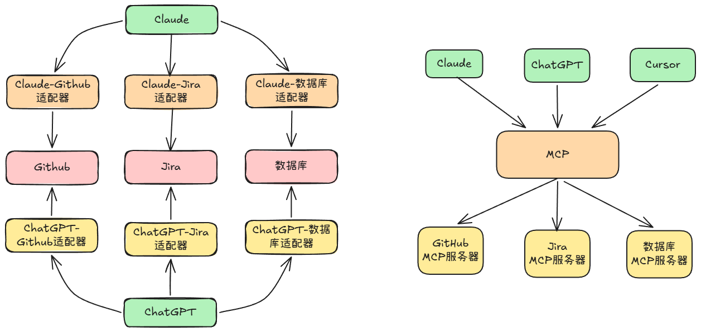
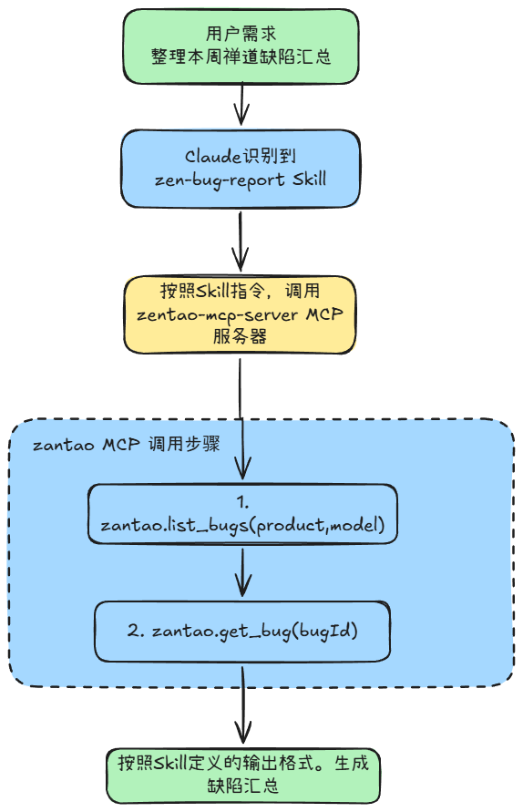

MCP：模型上下文协议（Model Context Protocol），解决的是AI与数据之间最古老的问题：如何实现安全、标准的连接。   

## 6.1 从M*N到M+N：标准化的力量

MCP的核心思路：定义一套通用的标准协议，在这个架构下，每个AI客户端只需要实现一次MCP客户端协议，而每个数据源也只需要实现一次MCP服务器协议。一旦双方都遵循这一标准，他们呢就能即插即用，不需要为每一对组合编写针对性的适配代码。




## 6.2 客户端-服务器与JSON-RPC

MCP 采用经典的客户端-服务器架构，基于JSON-RPC 2.0 协议进行通信。


一台 MCP 服务器可以向客户端“暴露”以下3类核心能力：

* **Tools**
	Tools 工具是最核心且最常用的能力。工具是供 Claude 主动调用的函数，如 “在Jira上创建新工单”、“查询过去7天的订单数据”。每个工具都定义了明确的名称、描述、输入参数架构（schema）及返回值格式。当Claude判断需要调用某工具时，会自动构造符合该架构的请求参数；服务器执行操作后，将返回结构化结果。
* **Resources**
	Resources(资源)的概念类似于“文件”，指供Claude按需读取的数据。其与工具的关键区别：工具用于执行操作（通常伴随副作用），而资源仅用于获取数据（只读）。例如：“获取README.md”的内容属于资源访问，而”向代码库提交commit“则属于工具调用。
* **Prompts**
	Prompts(提示词模板)是一类可复用的提示词片段，旨在使特定任务的启动方式标准化。例如：一台代码审查专用的MCP服务器可提供code-review 提示词模板，调用该模板时会自动载入标准化的审查格式与关注点。尽管改动能与Skills存在一定重叠，且在实际应用中普及度不及前两类，但它为任务初始化提供了便捷路径。

## 6.3 传输方式：连接的3种形态

MCP 的传输定义了客户端与服务器之间的物理通信机制。目前主要支持3中传输方式：

* **stdio(标准输入输出)：**
	为本地进程通信设计的方式。在此方式下，客户端以子进程形式启动MCP服务器，并通过标准输入（stdin）和标准输出（stdout）传递 JSON-RPC 消息。这种方式的优点是完全在本地运行，不需要网络连接，具备最高的安全连接及本地开发工具集成。绝大多数通过 npx 启动的官方MCP服务器都是采用此方式。
* **HTTP：** 
	远程服务器通信的推荐传输方式。AI客户端向指定的HTTP端点发送POST请求，服务器处理完毕后返回响应。该方式适用于部署在远端的MCP服务。此方式支持OAuth2.0认证，可与企业统一身份认证系统集成。
* **SSE：**
    曾是远程传输的初始方案，但目前已标记为废弃（deprecated）。如果在旧文档或者遗留项目中见到SSE配置，建议尽快迁移至HTTP传输方式。

遵循 “本地选择stdio，远程选择 HTTP”的简单准则即可满足绝大多数需求。

## 6.4 配置详解：从CLI到配置文件

### 6.4.1 CLI 快速配置
`Claude Code` 提供了一套 `claude mcp`命令，用于便捷地管理MCP服务器配置。

例如：
* 添加本地stdio服务器：启动一个本地文件系统服务，指定工作目录为 /workspace
```shell
# 添加本地stdio服务器：启动一个本地文件系统服务，指定工作目录为 /workspace
claude mcp add filesystem npm -y @modelcontextprotocol/server-filesystem /workspace
```

* 添加远程HTTP服务器：连接内网的Jira 服务
```shell
claude mcp add --transport http company-jira https://jira.company.com/mcp
```

* 添加用户级服务器（全局可用）：将Github服务添加到用户级别配置，使其对所有项目生效
```shell
claude mcp add --scope user github -- npx -y @modelcontextprotol/server-github
```

* 添加带认证信息的服务器，通过自定义HTTP头传递认证Token
```shell
claude mcp add --transport http --header "Authorization:Bearer ${TOKEN}" api https://api.example.com/mcp
```


**管理命令**
```shell
# 列出配置：查看当前所有已配置的MCP服务器
claude mcp list
# 测试连接：验证指定服务器的连接状态及可用性
claude mcp test github
# 移除服务器：删除指定的MCP服务器配置
claude mcp remove github 
```

### 6.4.2 .mcp.json文件
mcp cli 命令本质上是对 `.mcp.json`文件的操作。该文件的结构实现：
```json
{
	"mcpServers": {
		"fileSystem": {
			"command": "npx",
			"args": [
				"-y",
				"@modelcontextprotocol/server-filesystem",
				"/workspace"
			],
			"env": {}
		},
		"company-jira": {
			"type": "http",
			"url": "https://jira.company.com/mcp",
			"headers": {
				"Authorization:": "Bearer ${JIRA_TOKEN}"
			}
		},
		"postgres": {
			"command": "npx",
			"args": [
				"-y",
				"@modelcontextprotocol/server-postgres"
			],
			"env": {
				"DATABASE_URL": "${DB_URL:-postgresql://locahost:5432:mydb}"
			}
		}
	}
}
```

**其中${VAR_NAME}是环境变量替换，在运行时会使用系统环境变量或者`.env`中的真实数据替换。**

### 6.4.3 配置文件的位置与作用域
`.mcp.json` 配置文件根据存放位置的不同，具有不同的作用域。

| 文件路径  |  作用域  | 适用场景 |
| --- | --- |  --- |
| .mcp.json(项目根目录)    | 项目级    |  配置仅对当前项目生效。适用与团队共享的、与特定代码库绑定的服务。    |
| ~/.claude/ 目录 |  所有项目用户级别| 配置对所有项目生效。适用个人通用的工具。此文件位于用户主目录，不随项目变动|

如果某个 MCP 服务器的凭证不宜提交至Git仓库，可将凭证部分存入`.claude/setting.local.json`，而将服务器的基础配置保留在`./mcp.json`中。

## 6.5 实战1：连接数据库
需求： 让Claude查询数据库

1. 首先，配置一个 PostgreSQL MCP 服务器
```json
{
	"mcpServers": {
		"postgres": {
			"command": "npx",
			"args": [
				"-y",
				"@modelcontextprotocol/server-postgres"
			],
			"env": {
				"DATABASE_URL": "${DB_URL:-postgresql://locahost:5432:mydb}"
			}
		}
	}
}
```

２.　配置完成后，你只需要对Claude发出自然语言指令：
```plaintext
你：帮我查一下数据库了上个月的订单数量和总金额
Claude: 正在查询数据库....
[调用 postgres MCP Server: sql_query 工具]
上个月订单统计
- 订单数量：1,234笔
- 总金额：￥456,789.00
- 平均客单价：￥370.21
- 较上月增长：12.3%
```

在这个过程中，Claude会自动识别查询需求，定位Postgres MCP 服务器，生成并执行SQL，最后返回结果。
**安全原则**：数据库连接使用只读账号，否则，Claude 可以执行INSERT、UPDATE等高风险操作。

## 6.6 实战2：构建自定义的MCP服务器
当现有的MCP服务器无法满足需求时，可以利用 TypeScript或者Python SDK构建专属的MCP服务器。例如：以下是基于 TypeScript构建的一个查询禅道中缺陷及操作缺陷的MCP服务器示例。
```TypeScript
#!/usr/bin/env node
import { McpServer } from "@modelcontextprotocol/sdk/server/mcp.js";

import { StdioServerTransport } from "!@modelcontextprotocol/sdk/server/stdio.js";
import { z } from "zod";
import { ZentaoClient } from "./zentao-client.js";
const ZENTAO_URL = process.env.ZENTAO_URL;
const ZENTAO_ACCOUNT = process.env.ZENTAO_ACCOUNT;
const ZENTAO_PASSWORD = process.env.ZENTAO_PASSWORD;

if (!ZENTAO_URL || !ZENTAO_ACCOUNT || !ZENTAO_PASSWORD) {
  console.error(
    "Missing required environment variables: ZENTAO_URL, ZENTAO_ACCOUNT, ZENTAO_PASSWORD",
  );
  process.exit(1);
}

const client = new ZentaoClient({
  baseUrl: ZENTAO_URL,
  account: ZENTAO_ACCOUNT,
  password: ZENTAO_PASSWORD,
});
// 创建 MCP Server 实例
function createMcpServer(): McpServer {
  const mcpServer = new McpServer({
    name: "zentao-mcp-stdio",
    version: "1.0.0",
  });
  registerTools(mcpServer);
  return mcpServer;
}

function registerTools(mcpServer: McpServer): void {
  // Tool: list-bugs
  mcpServer.tool(
    "list-bugs",
    "根据查询条件查询Bug列表,支持按照产品、模块、严重程度、指派者、创建者条件进行筛选，支持分页和排序",
    {
      product: z
        .number()
        .optional()
        .describe("产品ID（通过 list_products 获取，不填则查询所有产品）"),
      module: z
        .number()
        .optional()
        .describe("模块ID（通过 list_modules 获取，不填则查询所有模块）"),
      status: z
        .string()
        .optional()
        .describe(
          "Bug状态（如：active、resolved、closed，不填则查询所有状态）",
        ),
      severity: z
        .number()
        .optional()
        .describe("严重程度（如：1、2、3、4，不填则查询所有严重程度）"),
      assignedTo: z
        .string()
        .optional()
        .describe("指派者（用户名，不填则查询所有指派者）"),
      openedBy: z
        .string()
        .optional()
        .describe("创建者（用户名，不填则查询所有创建者）"),
      orderBy: z
        .string()
        .optional()
        .describe(
          "排序方式，id_desc（按ID降序）、id_asc（按ID升序）、openedDate_desc（按创建时间降序）、openedDate_asc（按创建时间升序） ",
        ),
      page: z.number().optional().describe("页码（默认1）"),
      limit: z.number().optional().describe("每页数量（默认20，最大100）"),
    },

    async (params) => {
      try {
        // 将用户好友参数映射到禅道 browseType + param 参数
        let browseType = "all";
        const product = params.product || 0;
        const module = params.module || 0; 
        if (params.status) {
          browseType = `status-${params.status}`;
        } else if (params.severity) {
          browseType = `severity-${params.severity}`;
        } else if (params.assignedTo) {
          browseType = `assignedTo-${params.assignedTo}`;
        } else if (params.openedBy) {
          browseType = `openedBy-${params.openedBy}`;
        }
        const result = await client.listBugs({
          product,
          browseType,
          module,
          orderBy: params.orderBy || "id_desc",
          page: params.page || 1,
          limit: params.limit || 20,
        });
        const simplifiedBugs = result.bugs.map((bug) => ({
          id: bug.id,
          title: bug.title,
          status: bug.status,
          severity: bug.severity,
          pri: bug.pri,
          assignedTo: bug.assignedTo,
          openedBy: bug.openedBy,
          openedDate: bug.openedDate,
          module: bug.module,
          product: bug.product,
        }));
        return {
          content: [
            {
              type: "text" as const,
              text: JSON.stringify(
                {
                  total: result.total,
                  page: result.page,
                  limit: result.limit,
                  bugs: simplifiedBugs,
                },
                null,
                2,
              ),
            },
          ],
          isError: false,
        };
      } catch (err: unknown) {
        const msg = err instanceof Error ? err.message : String(err);
        return {
          content: [{ type: "text", text: `查询Bug列表失败: ${msg}` }],
          isError: true,
        };
      }
    },
  );

  // Tool: get-bug
  mcpServer.tool(
    "get_bug",
    "根据Bug ID获取Bug详情，包括标题、描述、复现步骤、状态、指派人、解决方案等所有字段",
    { bugId: z.number().describe("Bug ID") },
    async ({ bugId }) => {
      try {
        const bug = await client.getBug(bugId);
        return {
          content: [
            {
              type: "text" as const,
              text: JSON.stringify(bug, null, 2),
            },
          ],
        };
      } catch (err: unknown) {
        const msg = err instanceof Error ? err.message : String(err);
        return {
          content: [{ type: "text", text: `查询Bug详情失败: ${msg}` }],
          isError: true,
        };
      }
    },
  );
}
// 启动 MCP Server
async function main() {
  // 启动时先验证禅道的认证信息
  try {
    await client.authenticate();
    console.log("禅道认证成功，启动 MCP Server...");
  } catch (err: unknown) {
    const msg = err instanceof Error ? err.message : String(err);
    console.error(`[zentao-mcp-stdio]禅道认证失败: ${msg}`);
    process.exit(1);
  } 
  await startStdioServer();
}
  
// 启动基于STDIO的本地MCP Server
async function startStdioServer() {
  const mcpServer = createMcpServer();
  const transport = new StdioServerTransport();
  await mcpServer.connect(transport);
  console.log("[zentao-mcp-stdio] Server已启动(stdio JSON-RPC)，等待请求...");
}
main();
```

在上述代码中，有几个比较重要的地方：

*  `mcpServer.tool()`方法的第二个参数，这个参数是描述字符串，是Claude判断何时调用该工具的核心一句。描述写的越清晰、准确，Claude的意图识别和工具调用就越精准。
* 类型安全与校验：输入参数通过 Zod Schema 进行定义，提供了严格类型安全保障，也能在运行时自动校验参数的有效性，防止错误参数传入；
* 日志输出规范，在stdio的的连接形态下，stdout通道专门用于传输JSON-RPC消息，若混入普通日志，可能会导致协议解析失败。这个机制与Hooks脚本的调试输出原理一致。


## 6.7 安全机制
### 6.7.1 三层纵深安全机制

**第一层：首次连接的交互式审批**
每当用户配置了一台新的MCP服务器时，Claude在首次尝试连接该服务器前会自动暂停，并向用户展示服务器的详细信息(来源、权限范围等)，请求明确的显示授权。

**第二层：细粒度的工具级权限控制**
 即使整台MCP服务器已获得全局授权，Claude在调用具体的工具时仍需要保持警惕，特别是对具有副作用的操作（如文件写入、代码执行等）,Claude会在执行前再次拦截，向用户展示即将执行的具体指定细节，并等待二次确认。

**第三层：基于OAuth2.0 的动态认证**
对于远程MCP服务器，推荐使用OAuth2.0协议而非长期有效的静态API密钥。这种方式不仅便于与企业现有的统一身份认证系统集成以实现单点登录，而且支持令牌的自动过期与刷新机制

### 6.7.2 安全风险与防护

* 提示注入攻击：恶意内容可通过MCP服务器向Claude的上下文注入内容，若MCP服务器返回包含恶意指令的数据，Claude可能会被误导。防护措施是仅使用可信来源的MCP服务器。
* 工具权限滥用：单个工具的权限看似安全，但多个工具组合使用时可能产生意想不到的后果；例如：“读文件”与“发邮件”工具组合，可能造成文件内容泄露。防护措施是遵循最小权限原则。
* 冒名顶替：恶意工具可伪装成合法工具的名称和描述，诱导Claude调用。防护措施是安装可信来源的MCP服务器包。


## 6.8 MCP+Skills 
MCP 赋予了Claude 访问外部数据和工具的能力，而Skills 则指导Claude如何以以最优策略运用这些能力。唯有两者组合，方能构成完整的解决方案。MCP如同专业的厨房，Skills如同标准菜谱。在实际应用中，两者的协作模式：在Skills的SKILL.md中引用MCP工具，从而指导Claude按照特doing的工作流高效调用这些工具。这一组合赋予了Claude双重优势：既能通过MCP获取实时数据能力，又能借助Skills遵循一致的数据处理方式。这意味着，Claude不再依据每次的详尽指令，也不需要仰仗Claude的临时判断，即可实现稳定、高效的自动化执行。




## 6.9 企业级部署
对拥有数十或者上百名工程师的团队而言，依赖个人自动配置MCP服务器并非可扩展的方案，为此，Claude Code 提供了企业级的集中管理机制。

管理员可通过 managed-mcp.json 配置文件，为组织内所有用户预配置MCP服务器。这些服务器将自动对所有成员生效，不需要个人进行操作。

## 6.10 调试与故障排查

### 6.10.1 常用调试手段

```shell
# 列出所有已配置的MCP服务器及状态
claude mcp list

# 专门测试特定MCP服务器的连接连通性
claude mcp test <MCP名称>

# 启用MCP调试模式
claude --mcp-debug
```

### 6.10.2 MCP工具输出的Token管理
针对MCP可能返回海量数据的情况，Claude Code内置了专门的Token管理机制
* 警告阈值：当输出超过 10000 Token时，系统会显示警告提示；
* 截断阈值：当输出超过 25000 Token时，系统将自动对内容进行截断，防止上下文溢出；
* 自定义配置：用户可以通过设置环境变量`MAX_MCP_OUTPUT_TOKENS`来调整这一输出的上限，以使用不同的业务场景需求。
 
