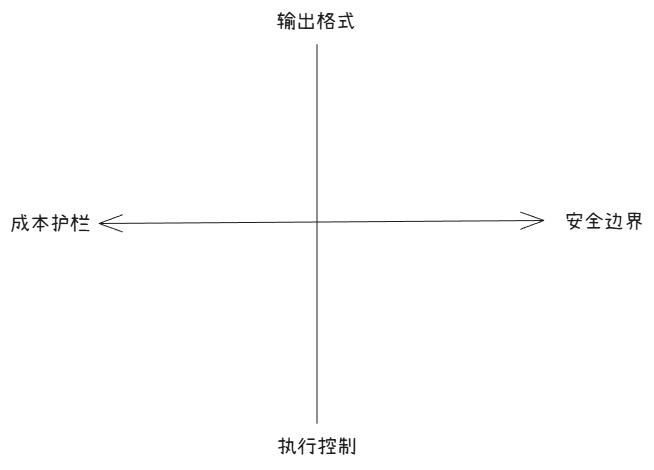

## 7.1 从人机交互到无人值守：一次关键的架构演进

在交互模式下，`Claude Code` 扮演着“在场对话伙伴”的角色：用户输入指令，`Claude`即时响应，待用户确认结果后继续下一轮对话。这种模式非常适合探索性工作。然而，在自动化场景中，没有人为的中间步骤把关，整个流程必须具备在零人工干预下从头到尾独立运行的能力。

`Headless`模式正式为此设计的，通过 `-p 或者 --print`参数，用户可以明确的告知`Claude Code`：“这是一次非交互式调用，请在任务完成后直接输出结果并退出，不需要等到任何用户输入。”
```shell
## 最基本的Headless模式调用
claude -p "分析 src/ 目录下的安全漏洞"

## 等价的完整形式
claude --print "分析 src/ 目录下的安全漏洞"
```

然而，`-p`仅仅是入口。真正将`Claude Code`转化为“可编程组件的”，是其完备的参数体系。要深入理解这套体系，首先需要清楚交互模式与Headless模式的核心差异

| 维度         | 用户界面              | 输入方式                 | 输出方式            | 权限确认           | 会话持久化        | 成本控制                                     | 典型场景              |
| :--------- | :---------------- | :------------------- | :-------------- | :------------- | :----------- | :--------------------------------------- | :---------------- |
| 交互模式       | 终端TUI，实时渲染        | 多轮实时对话               | 流式渲染Markdown    | 弹出式交互提示，需要人工确认 | 自动保存，支持断点续传  | 依赖人工观察与中段                                | 开发调试、架构探索         |
| Headless模式 | 无界面，仅标准输出（stdout） | 一次性Prompt（或者stdin管道） | 纯文本/JSON/流式JSON | 自动跳过或者依据白名单执行  | 默认不保存（可按需指定） | 通过 `--max-turns`或者`--max-budget-usd`硬性控制 | CI/CD流水线、定时任务、批处理 |

在交互模式下，人类实际上扮演者三个角色：权限审批者，质量检查者和流程控制者。当这3个角色缺席时，系统就必须在运行前将所有规则“硬编码”到参数中：哪些工具被授权调用？最多执行多少轮对话？输出必须遵循何种格式以便下游程序解析？这正是Headless 模式庞大参数体系的核心使命：将原本依赖人类直觉和实时判断的模糊过程，转化为一套确定性、可观测、可自动执行的工程规范。

## 7.2 核心参数体系：4个维度的控制



Headless 模式的参数并非杂乱无章，而是可以归纳为这4个维度，任何一次生产级的无人值守调用，都必须在4个维度上做出明确且坚定的决策。

### 7.2.1 输出格式控制
`--output-format` 参数是连接 `Claude code`与下游自动化流水线的“协议转换器”。它明确了输出数据的结构，直接决定了后续脚本或系统如何消费这些结果。

该参数包含了3中核心格式：
* text格式
* json格式
* stream-json 格式

**1. text格式**
最简单的纯文本输出，保留了自然的语言流，适用于直接阅读或者简单的脚本处理。
```
claude -p "列出主要问题" --output-format text
```

**2. json格式**
输出为一个完整的、严格结构化的JSON对象。它不仅包含任务结果，还封装了丰富的执行元数据，是构建健壮CI/CD流水线的基石。
```
claude -p "审查 PR" --output-format json
```
当使用`json`格式时，返回的对象包含审计和监控所需的全量信息。
```json
{
    "type": "result",
    "subtype": "success",
    "session_id": "4e353736-3535-40ec-95ea-59a61556c8de",
    "is_error": false,
    "duration_ms": 12345,
    "duration_api_ms": 10000,
    "num_turns": 5,
    "total_cost_usd": 0.0354,
    "usage": {
        "input_tokens": 5000,
        "output_tokens": 1500,
        "cache_creation_input_tokens": 0,
        "cache_read_input_tokens": 3000
    },
    "result": "发现2个严重问题：\n1. SQL 注入风险；\n2.提示词注入风险",
    "structured_output": null
}
```
在自动化运维和成本优化中，以下几个字段至关重要：
* total_cost_usd：可用于精确成本追踪，在CI/CD流水线中，用户可将每次运行的成本记录到数据库，生成任务报表，甚至对超出预算的部门进行自动告警或截断。
* num_turns：可用于执行轮次监控，反应模型实际交互的深度（对比设定的 `--max-turns` 限制）
* usage.cache_read_input_tokens：反应Prompt缓存的生效情况。在频繁调用相同的`System Prompt`或者基础代码库的场景中，`cache_read_input_tokens`越高，意味着跳过的计算越多，成本越低且速度越快。