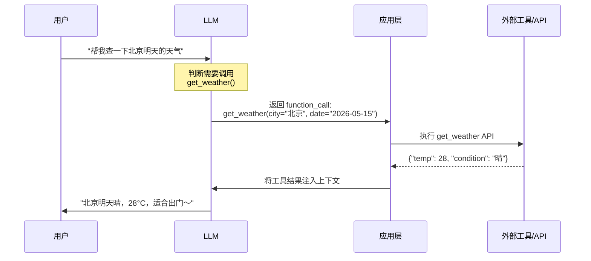
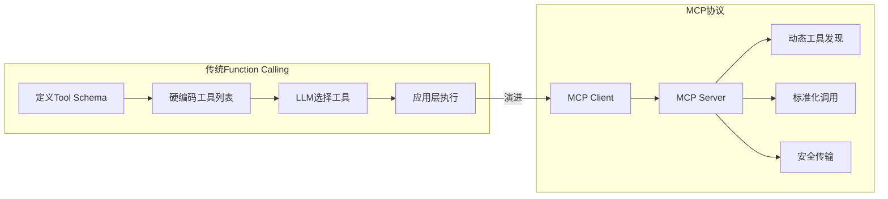

# 📱 抖音视频分析：Function Calling 老翻车？面试官就爱…

> **创作者：** 小哲讲agent
> **分析时间：** 2026-05-14
> **视频链接：** https://v.douyin.com/mhEimpPgzhw/
> **视频ID：** 7638618383612742938
> **主题：** Function Calling 原理、常见陷阱与面试要点

---

## 📋 视频描述

> Function Calling 老翻车？面试官就爱...

---

## 🔬 内容深度分析

### 核心主题

本视频聚焦 LLM 开发中一个高频痛点——**Function Calling（工具调用/函数调用）**。这是 AI Agent 与外部世界交互的基石能力，但也是开发者最容易"翻车"的环节。视频从常见失败场景切入，结合面试考察点，系统梳理了 Function Calling 的工程实践。

### 什么是 Function Calling？

Function Calling 是指 LLM 根据用户请求，自动决定调用哪些预定义的函数/工具，并生成合法的参数 JSON，再由应用层执行这些函数并将结果返回给 LLM 继续推理。



---

### Function Calling 常见"翻车"场景

#### 1. 参数生成错误（最频繁）

**表现：** LLM 生成的函数参数格式不对、缺少必填字段、类型错误。

| 错误类型 | 示例 | 原因 |
|---------|------|------|
| 参数缺失 | 调用 `send_email()` 没传 `body` | description 不够清晰 |
| 类型错误 | `limit=5` 传成了 `limit="5"` | Schema 定义与模型理解不一致 |
| 参数幻觉 | 调用不存在的参数 `temperature` | 工具描述误导 |
| 选择错误工具 | 应该调 search 却调了 create | 工具语义相似度混淆 |

**解决思路：**
- 工具 description 要写使用场景 + 排除场景（"如果用户问的是网络问题，别调这个"）
- 参数要写清楚格式约束和必填指引
- 避免工具名称过于相似

#### 2. 工具选择错误

**表现：** 应该调用工具A，LLM 却选择了工具B。

```python
# ❌ 差的设计
tools = [
    {"name": "search_db", "description": "搜索数据库"},
    {"name": "query_db", "description": "查询数据库"},
]

# ✅ 好的设计 - 区分使用场景
tools = [
    {"name": "search_products", "description": "搜索商品，当用户想要查找、浏览商品时使用"},
    {"name": "query_order", "description": "查询订单状态，当用户问某笔订单到哪了时使用"},
]
```

#### 3. 循环调用（Loop）

**表现：** Agent 反复调用同一个工具，陷入死循环。

**表现特征：**
- 调用工具 → 结果不理想 → 再调用一次相同工具 → 结果还是不理想
- 模型试图通过重复调用得到不同结果

**解决思路：**
- 设置最大调用轮次（max_turns）
- 工具返回结果中附带明确的后续建议
- 让工具返回更有区分度的结果

#### 4. 上下文污染

**表现：** 工具调用的中间结果占满上下文窗口，LLM 丢失对原始任务的关注。

**解决思路：**
- 工具结果摘要化：只返回关键信息而非全部数据
- 分层记忆：短期记忆（当前对话）与长期记忆（外部存储）分离
- 上下文裁剪：定期压缩/裁剪

#### 5. 工具描述过于简单

**表现：** LLM 不知道什么时候该用某个工具。

```markdown
# ❌ 差的描述
"获取天气信息"

# ✅ 好的描述
"根据城市名称和日期查询天气预报。
当用户问天气、温度、是否下雨、出门建议时使用。
如果用户问的是历史天气或气候数据，不要调用这个工具。
参数 city 必须是中文城市名（如'北京'、'上海'）。
参数 date 格式为 YYYY-MM-DD。"

# ✅ OpenAI 推荐的详细描述格式
"工具名称需要用简短准确的名字描述，description 要写清楚：
1. 什么场景下使用这个工具
2. 什么场景下不应该使用
3. 参数的具体约束和格式要求
4. 可能的副作用或注意事项"
```

---

### 面试高频考点

视频中提到的"面试官就爱问"，Function Calling 是 Agent 岗位的核心考点：

#### 考点一：Function Calling Schema 设计

**问题示例：** 如何设计好一个工具的 Schema？

**考察点：**
- JSON Schema 规范理解（OpenAI Function Calling 格式）
- description 的撰写技巧
- 参数类型、必填、枚举的合理使用
- MCP 协议的理解

#### 考点二：Function Calling 流程原理

**问题示例：** LLM 是如何决定调用哪个工具的？调用流程是怎样的？

**回答要点：**
1. LLM 收到的请求 + 工具列表（每个工具的 name + description + parameters）
2. LLM 推理判断是否需要调用工具
3. 如果需要 → 返回 `function_call` 对象（含 tool_name + arguments）
4. 应用层解析 arguments JSON，执行对应函数
5. 将执行结果注入下一轮 LLM 调用的上下文
6. LLM 基于结果继续推理

#### 考点三：错误处理与容错

**问题示例：** 工具调用失败怎么办？函数返回格式不对怎么处理？

**考察点：**
- 重试机制（retry with backoff）
- 错误信息回传 LLM 让模型自行纠正
- fallback 策略：工具不可用时给出优雅降级
- 超时处理

#### 考点四：安全性

**问题示例：** Function Calling 有哪些安全风险？怎么防范？

**考察点：**
- Prompt Injection：恶意用户让 LLM 调用危险工具
- 工具权限最小化原则
- 参数校验与过滤
- 高危操作需人工确认
- 沙箱隔离（Anthropic Managed Agents 的安全设计）

#### 考点五：性能优化

**问题示例：** 大量工具的场景下如何优化 Function Calling？

**考察点：**
- 工具分组（按领域/功能分类给不同 Agent）
- 工具检索（从大量工具中召回最相关的几个）
- Prompt Cache 优化
- 减少工具描述占用的 Token

---

### 补充：MCP（Model Context Protocol）

Function Calling 的演进方向之一就是 MCP 协议。



MCP 解决了 Function Calling 的几个痛点：
- **动态发现**：不用硬编码所有工具，MCP Server 可动态注册
- **标准化**：工具描述格式统一
- **安全传输**：OAuth token 在 Vault 中，Agent 不直接接触凭据
- **去中心化**：不同工具可部署在不同 MCP Server 上

---

### 补充：OpenAI vs Anthropic 的 Function Calling 对比

| 特性 | OpenAI | Anthropic Claude |
|------|--------|------------------|
| 接口名 | `function_call` / `tool_calls` | `tool_use` / `tool_result` |
| Schema 格式 | JSON Schema (OpenAPI) | JSON Schema 定义 |
| 并行工具调用 | ✅ 支持 | ✅ 支持（多 tool 同时） |
| 工具描述要求 | 中 | 高（Claude 对 description 更敏感） |
| 自动重试 | 需自己实现 | 需自己实现 |
| MCP 支持 | 第三方 | 原生支持 |
| 预/后填充思考 | 可通过 reasoning_effort | ✅ 内置 extended thinking |

---

### 补充：工具描述的最佳实践模板

```json
{
  "name": "工具英文名_清晰表达用途",
  "description": "工具的中文描述。解释这个工具做什么，
    什么时候应该用，什么时候不应该用。
    示例：当用户需要查询订单状态时使用此工具。
    如果用户询问的是商品信息，请使用 search_products 工具。",
  "parameters": {
    "type": "object",
    "properties": {
      "param1": {
        "type": "string",
        "description": "参数的详细说明，包括格式要求。"
      },
      "param2": {
        "type": "integer",
        "description": "参数的说明。",
        "minimum": 1,
        "maximum": 100
      }
    },
    "required": ["param1"]
  }
}
```

---

## 🛠️ 工程实践建议

### 快速排查 Checklist

当 Function Calling 翻车时，按这个顺序排查：

```
□ 工具 description 是否写清楚使用场景？
□ 参数 description 是否写明格式约束？
□ 工具名称是否和同类工具区分度够高？
□ 工具返回格式是否一致且可解析？
□ 是否设置了最大调用轮次？
□ 错误信息是否回传给了 LLM？
□ 上下文是否被中间结果污染？
```

### 代码实践：最小化翻车

```python
# 工具描述中写清楚"什么场景不用"
tools = [
    {
        "type": "function",
        "function": {
            "name": "query_order_status",
            "description": "查询订单当前状态（已下单、配送中、已完成等）。
                当用户问'我的订单到哪了'、'为什么还没到'时使用。
                如果用户问的是退款/退货，请使用 query_refund_status。",
            "parameters": {
                "type": "object",
                "properties": {
                    "order_id": {
                        "type": "string",
                        "description": "订单号，格式如 ORD-2026-0001"
                    }
                },
                "required": ["order_id"]
            }
        }
    }
]

# 工具返回结果也写清楚
def query_order_status(order_id: str) -> str:
    """返回格式化的结果，包含后续建议"""
    result = db.query(order_id)
    return f"""
    订单 {order_id} 当前状态：{result.status}
    预计送达：{result.estimated_delivery}
    
    提示：如果用户想修改地址，请调用 update_address({order_id})
    如果用户想取消订单，请调用 cancel_order({order_id})
    """
```

---

## 🔗 参考来源

- [Agent编写全攻略（博客园）](https://www.cnblogs.com/yangykaifa/p/19274840)
- [AI Agent 核心概念（JavaGuide）](https://javaguide.cn/ai/agent/agent-basis.html)
- [彻底搞懂 Agent（腾讯云）](https://cloud.tencent.com/developer/article/2576213)
- [OpenAI Function Calling 文档](https://platform.openai.com/docs/guides/function-calling)
- [MCP 协议规范](https://modelcontextprotocol.io/)
- [Anthropic Tool Use 文档](https://docs.anthropic.com/en/docs/build-with-claude/tool-use)
