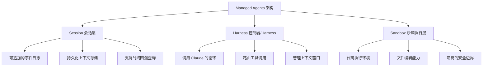
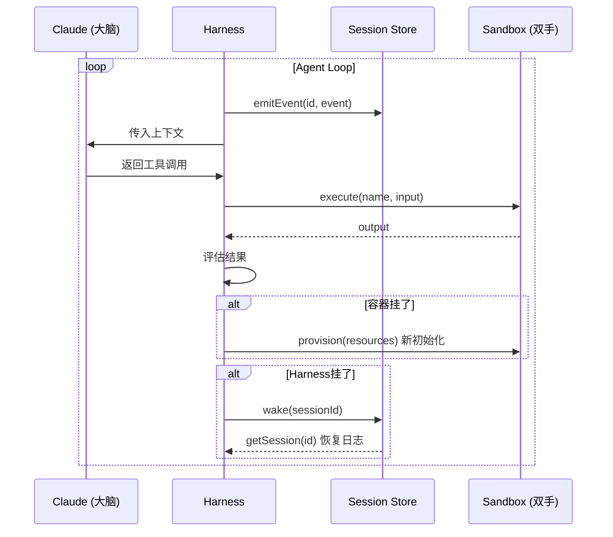
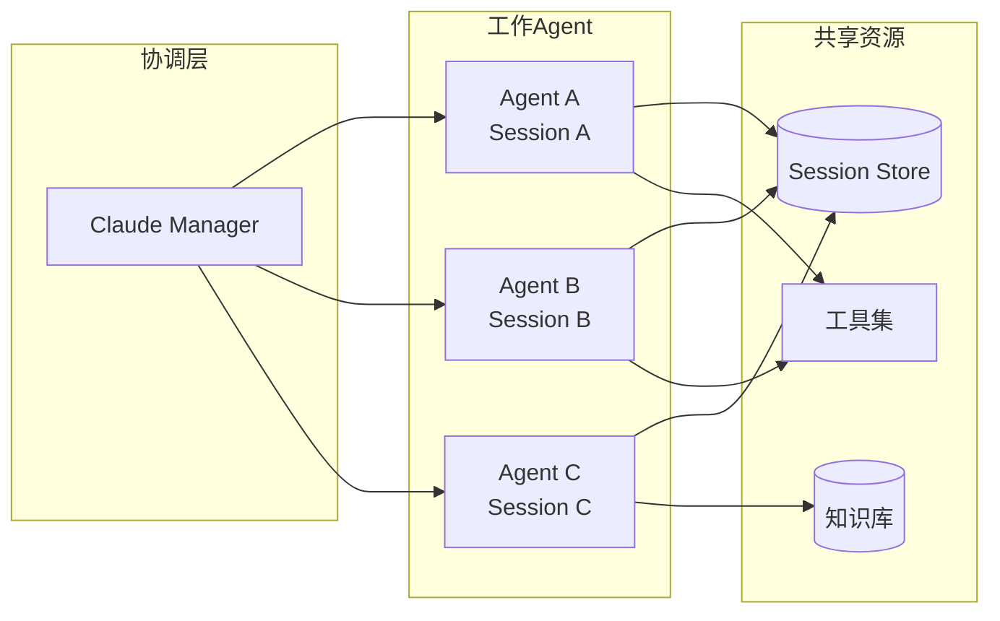

# 📱 抖音视频分析：Anthropic Managed Agents 架构深度解读

> **视频标题：** 比小龙虾更强！我发现了多Agent协作架构的版本答案！
> **分析时间：** 2026-05-14
> **视频链接：** https://v.douyin.com/Lug5iquIwVU/
> **视频ID：** 7638529068408851739
> **主题：** Anthropic Managed Agents 架构解析

---

## 📋 视频描述

> 比小龙虾更强！我发现了多Agent协作架构的版本答案！
> 今天为大家详细剖析 Anthropic的 Managed Agents架构
> 不是纸上谈兵，我自己已经搓出来了
> 为什么要做解耦，怎么样协作，SessionStore有什么意义
> 本期视频含金量超高
> 下期给大家解读FDE这个新职业
> 本期是个引子

**标签：** #ai新星计划 #agentswarm #agent协作 #Anthropic #managedagents

---

## 🔬 内容深度分析

### 背景：什么是 Managed Agents？

Anthropic 于 **2026年4月** 正式发布了 **Claude Managed Agents**（Public Beta），这是一个全托管的 Agent 平台，通过 API 让开发者在云端构建、部署生产级 AI Agent。

### 核心架构：大脑与双手解耦

Anthropic 解决了多Agent架构中最核心的矛盾——**耦合问题**。视频中提到的"解耦"正是这篇架构文章的灵魂：

#### 三大核心抽象

#### 为什么做解耦？

**原方案（耦合）的问题：**
- 所有组件塞进一个容器 →"宠物"式服务（Pet），挂了就丢
- 容器挂了 → Session 丢失 → 无法调试
- 安全缺陷：Prompt Injection 可直通凭据
- 客户想连 VPC 需要对等网络或自运行 Harness

**解耦后的好处：**
- 容器死亡 → Harness 捕获工具调用错误 → Claude 决定重试 → 新容器重新初始化
- Harness 死亡 → 从 Session 日志中恢复，从最后事件继续执行
- 安全边界：凭据永远不在沙箱中暴露
- 组件可独立替换和演进

#### SessionStore 的意义

视频中提到的 **SessionStore** 本质上就是 Session 抽象层：

- **不是 Claude 的上下文窗口** — Session 是独立于上下文窗口的持久化事件日志
- 大脑可以通过 `getEvents()` 按时间位置切片查询
- 支持：快进到最新位置、回退到特定事件之前、重新阅读某个动作前的上下文
- 任何被压缩/裁剪的上下文都可以从 Session 恢复

### 安全设计亮点

1. **凭据绑定资源** — Git token 在沙箱初始化时注入，Agent 从不直接操作
2. **MCP 代理** — OAuth token 存在安全 Vault 中，Harness 不知晓凭据内容
3. **零信任沙箱** — Prompt Injection 即使说服 Claude，也无法访问沙箱外的凭据

### 多Agent协作模式

基于 Managed Agents 的协作：

---

## 💡 我的解读

这期视频之所以说"含金量超高"，是因为它触及了 **2026年Agent工程的范式转变**：

1. **从单体到解耦** — 类似从单体架构到微服务的演进，差异在于Agent Components 的动态性远超传统后端
2. **从"宠物"到"牲畜"** — 彻底改变了 Agent 的运维模式，容器/Harness 挂了可以立即恢复
3. **Session 即数据库** — Session Store 本质上是 Agent 专属的"事件溯源数据库"
4. **安全第一** — 凭据与 Agent 逻辑严格分离，防止 Prompt Injection 的连锁破坏

视频作者已经"搓出来了"（自己实现了这套架构），说明他已经实际跑通了这套模式，不是纯理论分析。

---

## 🔗 参考来源

- [Anthropic 官方工程博客：Scaling Managed Agents](https://www.anthropic.com/engineering/managed-agents)
- [Claude Managed Agents 文档](https://platform.claude.com/docs/en/managed-agents/overview)
- [Claude Managed Agents 深度解读（知乎）](https://zhuanlan.zhihu.com/p/2025622381893304966)
- [Agent 系列：聊聊 Anthropic Managed Agents（腾讯云）](https://cloud.tencent.com/developer/article/2653871)
- [Managed Agents 上手指南](https://chenguangliang.com/posts/blog124_claude-managed-agents-guide/)
- [Agent 即服务时代来了（AI Insight）](https://www.ai-insight.org/reports/managed-agents-2026)
