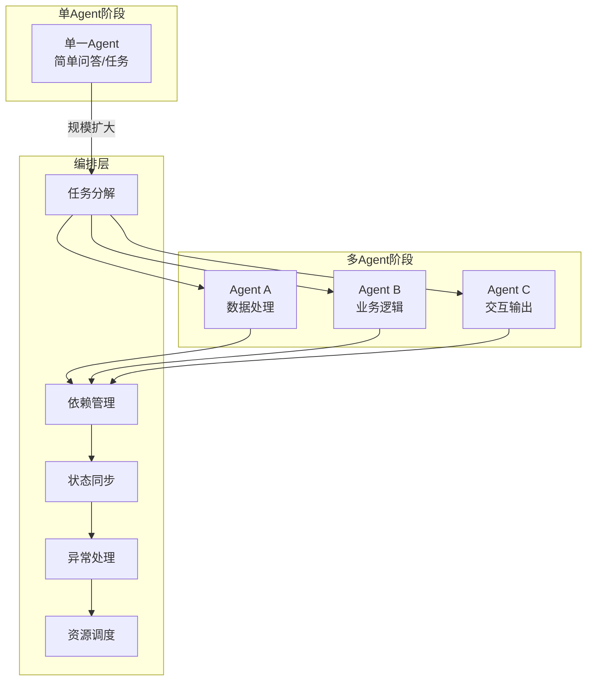
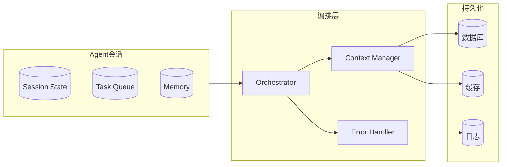
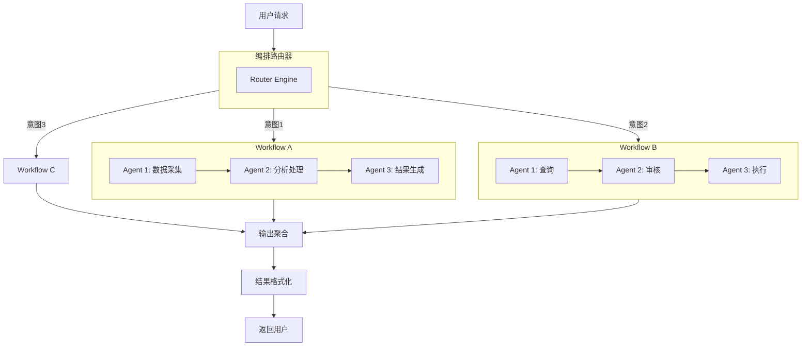

# 📱 抖音视频分析：企业 AI 落地离不开 Agent 的编排

> **创作者：** 自说自话的江哥
> **分析时间：** 2026-05-14
> **视频链接：** https://v.douyin.com/pmXERGCKiv8/
> **视频ID：** 7639318486057226597
> **主题：** 企业级 AI Agent 架构编排

---

## 📋 视频描述

> 企业 AI 落地离不开 Agent 的编排

---

## 🔬 内容深度分析

### 核心主题：企业 AI 落地的编排难题

本视频探讨了企业在落地 AI Agent 时面临的核心挑战——**编排（Orchestration）**。当 AI 从单点问答走向企业级自动化时，最关键的已经不是单个模型的能力，而是如何组织、协调、管理多个 Agent 协同工作。

### 为什么企业 AI 落地需要编排？

### Agent 编排的核心维度

#### 1. 任务编排（Task Orchestration）

企业场景中的任务通常不是单步操作，而是多个步骤的组合：

| 编排维度 | 说明 | 企业场景示例 |
|----------|------|-------------|
| **串行编排** | Agent A outputs → Agent B inputs | 数据清洗 → 分析 → 生成报告 |
| **并行编排** | 多个 Agent 同时执行 | 同时查询不同数据源 |
| **条件路由** | 根据结果动态选择下一步 | QA Agent → 通过/失败分支 |
| **循环迭代** | 反复执行直到满足条件 | 代码生成 → 测试 → 修复循环 |
| **人机协同** | Agent 执行 + 人工审批节点 | 自动生成合同 → 法务审批 |

#### 2. 状态编排（State Orchestration）

企业级 Agent 需要跨会话、跨任务维护状态：

#### 3. 工具编排（Tool Orchestration）

Agent 需要操作的工具有很多：数据库、API、文件系统、第三方服务等。

**关键问题：**
- **权限管理** — 不同 Agent 拥有不同的工具访问权限
- **工具注册** — 动态注册和发现工具能力
- **速率限制** — 避免 API 调用过载
- **故障转移** — 工具不可用时的降级方案

#### 4. 上下文编排（Context Orchestration）

与上一期讨论的 Managed Agents 中的 SessionStore 概念呼应：

- 上下文窗口管理
- 长期记忆与短期记忆分离
- 多 Agent 间的上下文共享与隔离
- 关键信息的外置存储（不塞在 LLM 上下文里）

### 编排架构参考模式

### 企业落地的挑战

#### 技术挑战
- **可观测性** — Agent 决策过程难以追踪，"黑箱"问题
- **可靠性** — LLM 的不确定性导致输出不稳定
- **成本控制** — Token 消耗在企业规模下迅速膨胀
- **延迟管理** — 多 Agent 串联调用叠加延迟

#### 工程挑战
- **状态持久化** — Agent 会话状态的可靠存储
- **并发控制** — 大量 Agent 同时运行的资源争抢
- **版本管理** — Agent 行为的迭代与回滚
- **测试验证** — 如何自动化测试 Agent 行为

### 编排框架对比

| 框架/方案 | 编排方式 | 适用场景 | 学习成本 |
|-----------|---------|---------|---------|
| LangGraph | 图编排（DAG） | 复杂多步流程 | 中 |
| Dify/Coze | 可视化 Workflow | 低代码企业场景 | 低 |
| Anthropic Managed Agents | 托管式编排 | 长期运行 Agent | 中 |
| 自建编排引擎 | 自定义 | 高度定制化场景 | 高 |
| Semantic Kernel | 编排管道 | .NET 生态 | 中 |

---

## 💡 我的解读

这期视频与上一期（Managed Agents）形成了很好的呼应：

1. **从微观到宏观** — 上一期讲单个 Agent 的内部架构（大脑/双手/会话），这期讲多个 Agent 如何协同工作

2. **企业视角的编排** — 企业落地 AI 不只是跑通一个 Demo，而是要解决：
   - 如何管理成百上千个 Agent 实例
   - 如何确保 Agent 行为符合企业规范
   - 如何和现有系统（ERP/CRM/OA）集成
   - 如何处理 Agent 的错误和安全风险

3. **编排层的重要性** — 与上一期 Managed Agents 中 Harness 的角色类似，编排层是连接"AI 能力"和"业务需求"的桥梁

4. **渐进式落地策略** — 实际企业落地路径通常是：
   - 先单 Agent 跑通一个场景
   - 再扩展到多 Agent 协作
   - 最后建立统一的编排平台

---

## 🔗 参考来源

- [AI Agent 核心概念（JavaGuide）](https://javaguide.cn/ai/agent/agent-basis.html)
- [Anthropic Managed Agents 架构](https://www.anthropic.com/engineering/managed-agents)
- [聊聊 Anthropic Managed Agents（腾讯云）](https://cloud.tencent.com/developer/article/2653871)
- [LangGraph 文档](https://langchain-ai.github.io/langgraph/)
