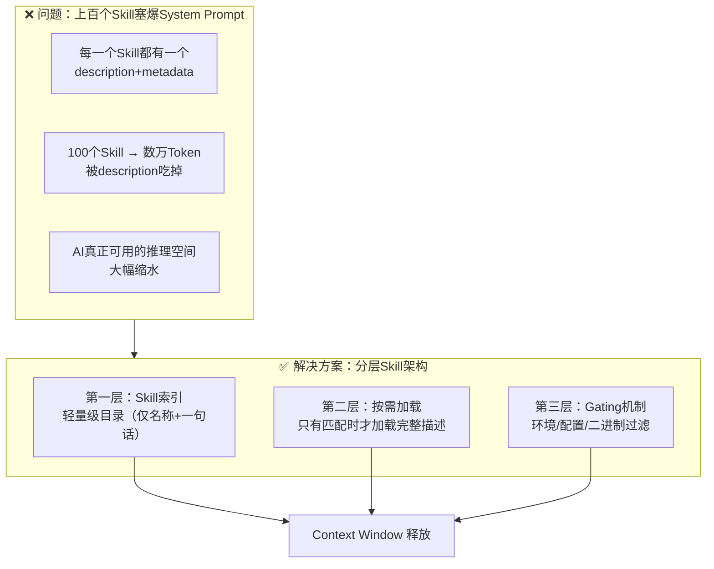
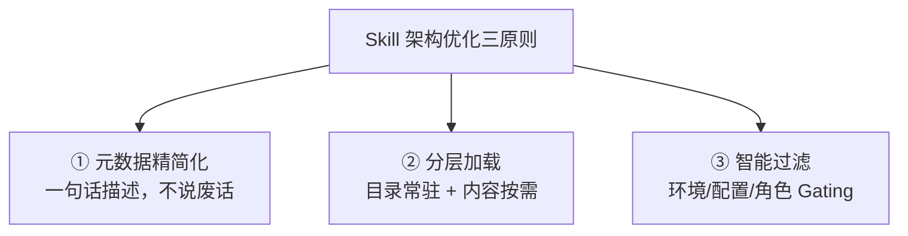

# 抖音视频分析：Skill 塞爆 System Prompt 的架构重构

> **来源：** 抖音
> **日期：** 2026-05-14
> **视频ID：** 7638562818790313267
> **标签：** #ai大模型 #大模型面试 #大模型应用 #知识分享

---

## 📝 视频基本信息

| 项目 | 内容 |
|------|-------|
| **标题** | 面试官：当上百个 Skill 塞爆 System Prompt 时你该如何进行架构重构与优化？ |
| **场景** | AI 大模型面试题 |
| **关键词** | Skill、System Prompt、上下文窗口、架构优化 |

---

## 🎯 核心问题

> **上百个 Skill 的元数据全部塞进 System Prompt → 上下文窗口被占满 → AI 反而变笨**

这本质上是 **Context Window 资源管理** 问题——Skill 的 description + metadata 加在一起可能远超 context window 的合理使用范围。

---

## 面试题解法架构图



---

## 核心优化策略

### 1️⃣ Skill 元数据瘦身（Metadata Diet）

**问题：** 每个 Skill 的 description 字段写得像小作文，100 个 × 200 Token = 20,000 Token

**解法：**
| 优化点 | 做法 | Token 节省 |
|--------|------|-----------|
| description 精简 | 只写触发场景，不写具体操作 | 60-80% |
| 去掉冗余字段 | 只保留 name + description + triggers | 20-30% |
| 统一分类前缀 | 如 `git:`、`docker:`，按 namespace 分组 | 10-15% |
| triggers 聚合 | 同类 triggers 写到 Description 里，不单独列 | 5-10% |

### 2️⃣ 分层加载（Layered Loading / Progressive Disclosure）

**核心思想：** AI 上下文里只放 Skill 的"目录"，详细内容按需加载

```
第一层（常驻上下文）
├── Skill A: 处理 Git 相关操作
├── Skill B: 处理 Docker 部署
├── Skill C: 处理 API 测试
└── ... (每行 < 20 Token, 共 100 个 ≈ 2,000 Token)

第二层（按需加载）
├── Skill A 完整 SKILL.md 内容
├── Skill C 完整 SKILL.md 内容
└── 只有 AI 判断需要时才加载
```

**关键机制：**
- **Skill Gating** — 根据环境变量、配置文件、操作系统等过滤不可用的 Skill
- **Lazy Loading** — 只有 trigger 匹配时才加载完整内容
- **Hot Reloading** — 根据当前任务上下文动态调整 Skill 集合

### 3️⃣ Skill Gating（过滤机制）

**原理：** 不在 context window 里硬塞所有 Skill，而是用规则提前过滤

```
graph LR
    A[所有 Skill] --> B{Gating 规则}
    B -->|匹配环境| C[加载]
    B -->|不匹配| D[跳过]
    B -->|二进制不存在| D
```

**常见 Gating 条件：**
| 条件 | 示例 |
|------|------|
| 操作系统 | `requires.os: "linux"` |
| 工具存在 | `requires.bins: ["docker", "kubectl"]` |
| 环境变量 | `requires.env: ["AWS_PROFILE"]` |
| 配置项 | `requires.config: ["git.enabled"]` |
| 用户角色 | `requires.role: "admin"` |

### 4️⃣ Skill 与 CLI 的配合（按需加载 vs 常驻）

引用唐巧博客中的比喻：

> - **MCP** = 工具常驻在桌上 → 方便但占桌面空间
> - **CLI** = 工具放在柜子里 → 按需取用，不占桌面
> - **Skill** = 操作手册 → 让 AI 知道怎么用工具

**优化方向：优先 CLI-based Skill，减少不必要的 MCP 常驻开销**

| 维度 | MCP（常驻） | CLI（按需） | Skill（按需） |
|------|-----------|-----------|-------------|
| 上下文占用 | 高（常驻描述） | 低（不占） | 低（目录索引） |
| 调用速度 | 快（直接调用） | 慢（需先查） | 中（需先匹配） |
| 适合场景 | 核心高频工具 | 低频/大量工具 | 复杂工作流 |

### 5️⃣ 上下文压缩策略

当 Skill 元数据必须常驻时：


**压缩手段：**
- **语义压缩** — 用更少的话表达同样的意思
- **结构化索引** — 按功能领域分组，只加载匹配组
- **优先级排序** — 高频 Skill 给更多描述空间，低频的只留名称
- **动态替换** — 当前任务结束后，卸载不需要的 Skill，加载新的

---

## 📊 优化前后对比

| 维度 | 优化前 | 优化后 |
|------|--------|--------|
| Context Window 占用 | ~30,000+ Token（100 个 Skill） | ~2,000 Token（索引目录） |
| AI 响应质量 | 下降（上下文被稀释） | 提升（专注当前任务） |
| 新增 Skill 成本 | 高（每加一个都在挤占空间） | 低（只加索引条目） |
| 维护复杂度 | 高（互相影响） | 低（独立维护） |
| 匹配准确率 | 低（选项太多易选错） | 高（Gating 过滤+精准匹配） |

---

## 💡 核心观点提炼

> **「Skill 不是越多越好，塞爆 System Prompt 的 Skill 会让 AI 变笨。」**

这个面试题考察的不是"你知道多少种优化技巧"，而是：
1. **对 Context Window 本质的理解** — 资源是有限的，不能无限往里面塞
2. **架构分层思维** — 不是所有信息都要常驻，分层的核心是"常驻目录+按需加载"
3. **工程化思维** — Gating、按需加载、动态替换都是成熟的工程模式

**最佳实践总结：**



---

## 🔗 参考资料

- [唐巧博客：AI 干活的三件套 CLI、MCP 和 Skill](https://blog.devtang.com/2026/04/03/cli-mcp-skill/)
- [AgentSkills 协议](https://agentskills.io) — Skill 标准化规范
- [OpenClaw Skills 配置](https://docs.openclaw.ai/tools/skills-config) — Skill Gating 实现参考
- [Claude Code Skill Creator](https://docs.anthropic.com/en/docs/claude-code/skills/skill-creator)
