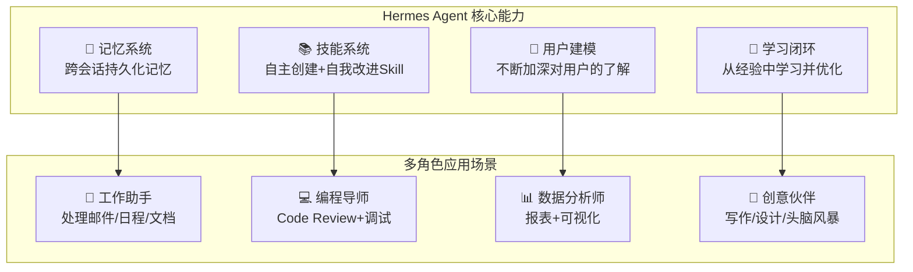

# 抖音视频分析：HermesAgent——创建不同角色，搭建专属AI团队

> **来源：** 抖音
> **日期：** 2026-05-23
> **链接：** https://v.douyin.com/eG_I2zkNOBQ/
> **作者：** 古法编程-小周
> **标签：** #HermesAgent #AI Agent #多角色 #自动化

---

## 📝 视频基本信息

| 项目 | 内容 |
|------|-------|
| **标题** | HermesAgent 创建不同角色，可以搭建你的专属AI团队 |
| **作者** | 古法编程-小周 |
| **主题** | 用 Hermes Agent 搭建不同角色的 AI 智能体 |

---

## 🎯 什么是 Hermes Agent？

**Hermes Agent** 是 **Nous Research** 打造的开源 AI 智能体框架，核心卖点是 **"会自我进化的 Agent"**。

> 它不是一个绑定 IDE 的编程助手，也不是单个 API 的聊天包装器。它是一个**运行时间越长越聪明的自主 Agent**。



---

## 核心特性

### 1. 自学习闭环

| 功能 | 说明 |
|------|------|
| **自主技能创建** | 完成复杂任务后，Agent 自动把经验沉淀为可复用的 Skill |
| **技能自我改进** | Skill 在使用中不断优化，越用越准 |
| **定期记忆提醒** | 自动推动自己持久化知识（Memory Nudge） |
| **跨会话搜索** | FTS5全文搜索 + LLM 摘要，找回历史对话 |

### 2. 多角色支持

视频中重点演示的——为不同场景创建不同角色的 Agent：

```
# 编程角色
hermes agent create coder \
  --system-prompt "你是一个资深Python后端工程师" \
  --tools "code-interpreter,github"

# 写作角色
hermes agent create writer \
  --system-prompt "你是一个科技专栏作者，擅长深入浅出"

# 研究角色
hermes agent create researcher \
  --system-prompt "你是一个AI研究员，擅长文献综述"
```

每个角色可以有独立的：
- 系统提示词（人格设定）
- 工具集（可用能力）
- 知识库（专项领域文档）
- 记忆（个性化历史）

### 3. 多平台支持

| 平台 | 支持情况 |
|------|---------|
| Telegram | ✅ |
| Discord | ✅ |
| WhatsApp | ✅ |
| Slack | ✅ |
| Signal | ✅ |
| CLI/TUI | ✅ 终端界面 |

### 4. 任意模型切换

支持 200+ 模型，一行命令切换：
- Nous Portal
- OpenRouter
- OpenAI
- Hugging Face
- NVIDIA NIM
- 小米 MiMo
- Kimi/Moonshot
- MiniMax
- 本地部署模型

### 5. 部署灵活

- **$5 VPS** 就能跑
- **Docker / SSH / Modal / Daytona** 多种后端
- **Serverless** — 空闲时几乎零成本

---

## 💡 视频核心观点

> **"不是让你用一个 Agent 干所有事，而是用 Hermes Agent 搭建一个专属的多角色 AI 团队。"**

该视频的关键洞察：

1. **角色分离是生产力的关键** — 一个全能 Agent 不如 3-5 个专注角色的 Agent 效果好
2. **记忆积累是差异化的来源** — 每个角色的记忆独立成长，越用越懂你
3. **技能复用降低门槛** — 一次学到的经验（如 Git 工作流），自动跨角色共享

**与 Claude Code / Copilot 的对比：**

| 维度 | Hermes Agent | Claude Code | Copilot |
|------|-------------|-------------|---------|
| 定位 | 通用自主Agent | IDE编程助手 | 代码补全 |
| 学习能力 | ✅ 自学习闭环 | ❌ 无状态 | ❌ 无状态 |
| 多角色 | ✅ 原生支持 | ❌ | ❌ |
| 模型选择 | 200+自由切换 | Claude独占 | GPT独占 |
| 部署 | 服务器独立运行 | 本地CLI | IDE插件 |
| 开源 | ✅ Apache 2.0 | ❌ | ❌ |

---

## 🔧 快速上手

```bash
# 安装（60秒）
curl -fsSL https://raw.githubusercontent.com/NousResearch/hermes-agent/main/scripts/install.sh | bash

# 创建角色
hermes agent create my-agent --model openrouter/anthropic/claude

# 开始对话
hermes chat my-agent
```

---

## 🔗 参考资料

- [Hermes Agent 官网](https://hermes-agent.nousresearch.com/)
- [GitHub: NousResearch/hermes-agent](https://github.com/NousResearch/hermes-agent)
- [Hermes Agent 文档](https://hermes-agent.nousresearch.com/docs/)
- [agentskills.io 开放标准](https://agentskills.io)