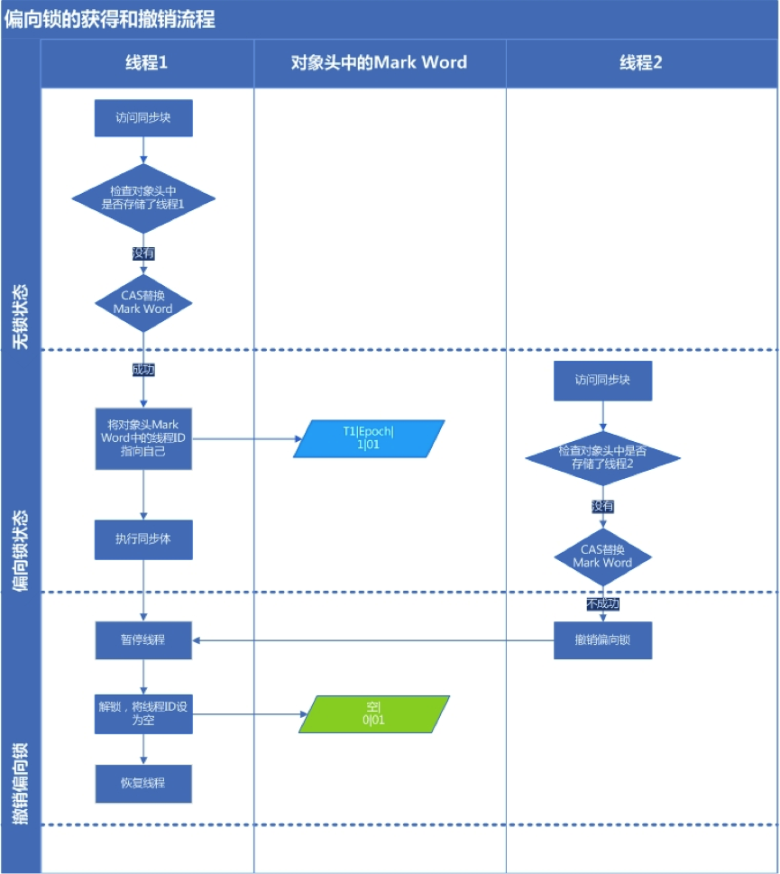
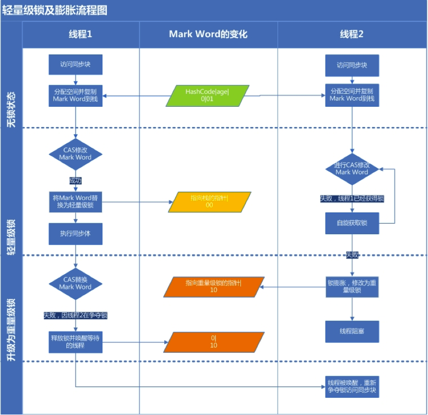

== Synchronized
=== 一、为什么使用Synchronized
在并发编程中存在线程安全问题，主要原因有：::
1、存在共享数据； +        
2、多线程操作共享数据。

关键字Synchronized可以保证在同一时刻，只有一个线程可以执行某个方法或者某个代码块，同时 Synchronized可以包含保证一个线程的变化可见，即可以代替 Volatile。

=== 二、应用方式

Java中每一个对象都可以作为锁，这是 Synchronized 实现同步的基础。

* 1. 普通同步方法(实例方法)，锁是当前实例对象，进入同步代码钱需要获取当前实例的锁；
* 2. 静态同步方法，锁是当前类的 class 对象，进入同步代码前需要获得当前类对象的锁；
* 3. 同步方法块，锁是括号里面的独享，对给定对象加锁，进入同步代码块前需要获取给定对象的锁。   

=== 三、实现原理
从 JVM 规范中可以看到 Synchronized 的实现原理：JVM 基于进入和退出 Monitor 对象来实现代码块的同步。    
        
monitorenter 指令是在编译后插入到同步代码块的开始位置，而 monitorexit 指令是插入到方法结束处和异常处，JVM 要保证每一个 monitorenter 必须有对应的 monitorexit 与之配对。任何对象都有一个 monitor 与之关联，当且一个monitor被持有后，它将处于锁定状态。线程执行到 monitorenter指令时，将会尝试获得对象所对应的 monitor 的所有权，即尝试获取对象的锁。
       
线程进入与退出 monitor:

* 线程执行 monitorenter 指令的过程:

** 1：如果 momnitor 的进入数为0，则该线程进入 monitor，然后将 monitor的进入数设置为1，该线程即为 monitor 的拥有者；
** 2：如果线程已经占有该 monitor，只是重新进入，则进入 monitor 的进入数加1；
** 3：如果其他线程占用了 monitor，则该线程进入阻塞状态，直到 monitor 的进入为0，再重新尝试获取 monitor 的所有权。

* 线程执行monitorexit 指令的过程：

** 1：执行monitorexit的线程必须是锁对象对应的 monitor 的 拥有者。
       monitorexit 指令执行时，monitor 的进入数会减 1，如果减 1 后进入数为 0，那这个线程就退出 monitor,不再是这个 monitor 的拥有者。其他被这个monitor阻塞的线程可以尝试去获取这个 monitor 的所有权。 
** 2：如果其他线程已经占用了monitor，则该线程进入阻塞状态，直到monitor的进入数为0，再重新尝试获取monitor的所有权。

=== 四、对象的锁

synchronized 实现同步的关键就是锁，而对象的锁就是存在 Java 对象头里的。如果对象是数组类型，则 32 位虚拟机用 3 个字宽存储对象头；如果对象是非数组类型，则用 2 字宽存储对象头。在 32 位虚拟机中，1字宽 = 4字节 = 32 bit。
        
.Java 对象头长度
[width="100%",options="header,footer"]
|====================
^| 长度 ^|内容 ^|  说明
^|32/64 bit ^|Mark Word ^|存储对象的 hashCode 或锁信息等
^|32/64 bit ^| Class Metadata address ^| 存储到对象类型数据的指针
^|32/64 bit ^| Array length ^| 数组的长度（如果当前对象是数组）   
|====================
Java 对象头里的 Mark Word 默认存储对象的 hashCode、分代年龄和锁标记位。32位 JVM 的 Mark Word 的默认存储结构如下：
    
.32位 JVM 的 Mark Word 的默认存储结构
[width="100%",options="header,footer"]
|====================
^|锁状态 ^|25 bit ^| 4 bit ^| 1 bit 是否是偏向锁 ^| 2 bit 锁标志位
^|无锁状态 ^|对象的hashCode ^|对象的分代年龄 ^|0 ^|01  
|====================
 
在运行期间， Mark Word 里存储的数据会随着锁标志位的变化而变化。 Mark Word 可能变化为存储以下 4 中数据：

.32位 JVM 的 Mark Word 的状态变化
|====================
.2+^|锁状态 2+^|25bit .2+^|4bit ^|1bit ^|2bit
^|23bit ^|2bit ^|是否是偏向锁 ^|锁标志位
^|轻量级锁 4+^|指向栈中锁记录的指针 ^|00
^|重量级锁 4+^|指向互斥量(重量级锁)指针 ^|10
^|GC标记 4+^|空 ^|11
^|偏向锁 ^|线程ID ^|Epoch ^|对象分代年龄 ^| 1 ^|01
|====================

.64位 JVM 的 Mark Word 的状态变化
|====================
.2+^|锁状态 ^|25 bit ^|31 bit  ^|1 bit  ^|4 bit  ^|1 bit  ^|2bit  
^|  ^|  ^| cms_free  ^| 分代年龄 ^| 偏向锁 ^| 锁标志位  
^|无锁 ^| unused ^|hashCode ^|  ^|  ^|0  ^| 01  
^|偏向锁 2+^| ThreadId(54 bit);Epoch(2bit)  ^|  ^|  ^|1  ^| 01 |  
|====================

=== 五、锁的升级与对比
Synchronized 实现线程安全的主要原理就是获得对象锁。而获得锁和释放锁又会消耗大量的性能资源。所以为了减少性能消耗，Java SE 1.6 就引入了"偏向锁"和"轻量级锁"。在 SE 1.6 中，锁一共有 4 中状态：**无锁状态**、**偏向锁状态**、**轻量级锁状态**和**重量级锁状态**。这几个状态会随着竞争情况而逐渐升级，但是需要注意的是锁可以升级但是不能降级，也就是说一个锁一旦升级为轻量级锁后就不能降级为偏向锁。这种能升级但是不能降级的策略是为了提高获得锁和释放锁的效率。    

==== 1、偏向锁
在大多数情况下，锁不仅不存在多线程竞争，而且总是有同一线程多次获得，所以为了让线程获得锁的代价更低而引入了偏向锁。当一个线程访问同步代码块并获取锁时，会在对象头和栈针中的锁记录里面存储偏向的线程ID，以后该线程在进入和退出同步代码块时不需要进行 CAS 操作来加锁和解锁，只需要简单的测试一下对象的 Mark Word 里是否存储指向着当前线程的偏向锁。如果测试成功，则表明线程已经获得了锁；如果测试失败，则需要再测试一下 Mark Word 中偏向锁的表示是否设置成 1(表示当前是偏向锁)：如果没有设置，则使用 CAS 竞争锁；如果设置了，则尝试使用 CAS 将对象头的偏向锁指向当前线程。
    
===== 1.1 偏向锁的撤销    
在偏向锁需要升级为轻量级锁的时候，会进行偏向锁的撤销。**偏向锁使用了一种等到竞争出现才释放锁的机制**。所以一旦线程获得了对象的偏向锁，如果不存在其他的线程来竞争这个锁，那么获得锁的线程就不会释放该对象的偏向锁。只有在其他线程尝试竞争偏向锁时，持有偏向锁的线程才会释放锁。而偏向锁的撤销，需要等待**全局安全点**(在这个时间点上没有正在执行的字节码)。
    撤销的过场就是先暂停拥有偏向锁的线程，然后检查持有偏向锁的线程是否活着，如果这个线程不处于活动状态，则将对象头设置成无锁状态；如果线程仍然活着，拥有偏向锁的线程会被执行，遍历偏向对象的锁记录，栈中的锁记录和对象头的 Mark Word 要么重新偏向其他线程，要么恢复到无锁或者标记对象不适合作为偏向锁，最后唤醒暂停的线程。    
    
下图展示偏向锁的初始化和撤销过程:

===== 1.2 关闭偏向锁
偏向锁在 Java6 和 Java7 上默认是启用的，但是它是在应用程序启动几秒钟之后激活的。我们可以通过 
    `-XX:BiasedLockingStartupDelay=0` 来关闭延迟。当然，如果我们确认应用程序所有的锁通常都是处理竞争的状态，我们也可以通过 `-XX:-UseBiasedLocking=false` 来关闭偏向锁，这样的话程序默认会进入轻量级锁状态。

==== 2、轻量级锁    
当一个对象的偏向锁已经被一个还在活动的线程(线程1)占据时，此时又有另外一个线程(线程2)去获取这个对象的锁并且没有获取到时，这个时候这个对象的锁就会升级为轻量级锁，并且线程2会通过自旋获取锁。
    
===== 2.1 轻量级锁加锁
线程在执行同步块之前，JVM 会在当前线程的栈针中创建存储锁记录的空间，并且将对象头中的 Mark Word 复制到锁记录中。然后线程尝试使用 CAS 将对象头的 Mark Word 替换为执行锁记录的指针。如果成功，当前线程获得锁；如果失败，表示其他线程竞争锁，当前线程便通过自旋来获取锁。
    
===== 2.2 轻量级锁解锁
轻量级锁解锁时，会使用原子的 CAS 操作将栈针中的锁记录替换回到对象头。如果成功，则表示没有竞争发生；如果失败，表示当前锁存在竞争，此时锁就会膨胀为重量级锁。下图是两个线程同时争夺锁导致锁膨胀的流程图：

由于自旋会消耗 CPU，所以为了避免无用的自旋（比如获得锁的线程被阻塞住了），一旦锁升级为重量级锁，就不会恢复到轻量级锁，一旦锁升级成了重量级锁，其他线程尝试去获取锁时，就不会通过自旋去获取锁，而是直接阻塞住，只有当持有锁的线程释放锁后才会唤醒这些线程，这些线程就会开始新一轮的竞争锁。

==== 3、锁的优缺点
.各种锁的优缺点对比
[width="100%",options="header,footer"]
|====================
^|锁 ^|优点 ^| 缺点 ^| 适用场景 
^|偏向锁 ^|加锁和解锁不需要额外的消耗，和执行非同步方法相比仅存在纳秒级的差距 ^|如果线程之间存在锁竞争，会带来额外的锁撤销的消耗 ^|适用只有一个线程访问同步块的场景
^|轻量级锁 ^|竞争的线程不会阻塞，提高了响应速度 ^|如果始终得不到锁竞争的线程，会使用自旋持续消耗 CPU ^|追求响应时间，执行速度非常快的同步块
^|重量级锁 ^|线程竞争不会使用自旋，不会造成某个线程持续消耗CPU ^|线程阻塞，响应时间缓慢 ^|追求吞吐量，执行时间较长的同步块
|====================
