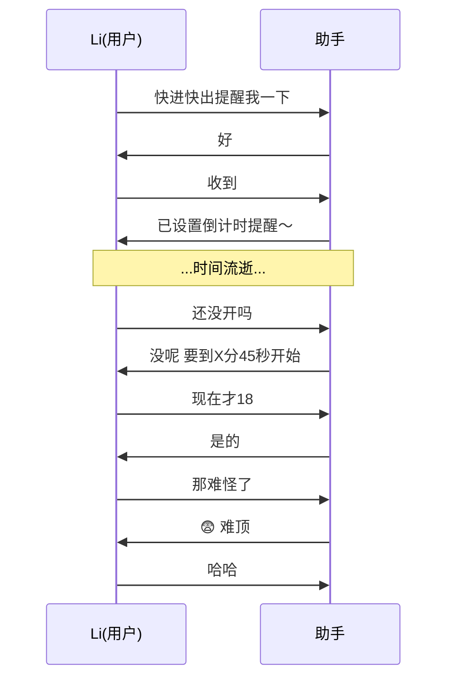
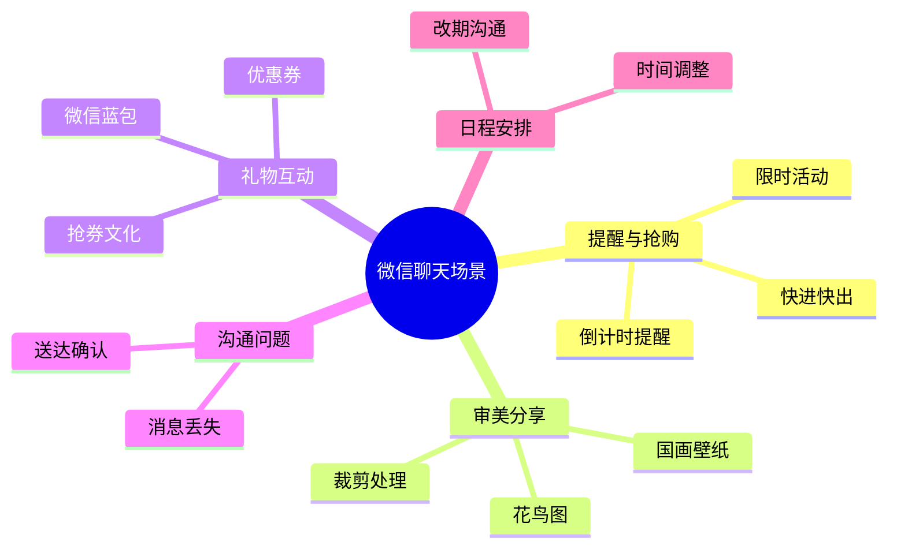

# 微信聊天截图汇总分析

> 分析时间：2026-05-14
> 共 5 张截图

---

## 截图一：倒计时提醒

**内容：**
- Li 请求对方设置一个"快进快出"提醒
- 对方设置了倒计时提醒
- 后来 Li 询问活动是否开始
- 被告知预计在 **X 分 45 秒** 开始
- Li 说"现在才 18"，对方确认
- Li 感慨"那难怪了"
- 对方表示"😨 难顶"，Li 哈哈一笑

**场景分析：** 这是一个限时抢购/红包活动的倒计时提醒场景。助手先设置了提醒，用户后来着急确认，发现时间还没到。

---

## 截图二：国画壁纸分享

**内容：**
- 分享了一张 **传统国画风格的梅花枝头黄雀图**
- 来源是"随便捡的"，实际上是**电脑壁纸截图**
- 对方称赞"好看"、"很有意境"
- 计划用软件裁剪下来做壁纸

**场景分析：** 审美分享类对话。一张传统的工笔花鸟壁纸引发了共鸣，还涉及了二次创作（裁剪处理）。

---

## 截图三：微信蓝包

**内容：**
- 有人发送了 **微信蓝包**（礼物功能）
- 对方表示感谢
- 有人要求"再发个"
- 回复"发不了"
- 感叹"这个券还得抢"

**场景分析：** 微信礼物互动场景。蓝包是微信的送礼功能，但连优惠券都需要抢，反映出热门礼物的稀缺性。

---

## 截图四：消息送达问题

**内容：**
- 有人发送了消息/内容
- 对方表示**未收到**
- 来回确认消息是否成功发送

**场景分析：** 日常沟通中的消息送达问题，可能是网络延迟或微信消息丢失的常见情况。

---

## 截图五：时间安排/改期

**内容：**
- 关于时间调整的对话
- 涉及"提前可以吗"等时间安排的询问

**场景分析：** 日程协调、时间调整的沟通场景。

---

## 整体主题分析

这些截图展示了微信日常聊天的多个典型场景：

## 总结

这 5 张截图涵盖了用户在微信上的多种社交场景：

| # | 主题 | 关键词 |
|---|------|--------|
| 1 | 倒计时提醒 | 抢购、提醒、限时 |
| 2 | 艺术分享 | 国画、壁纸、意境 |
| 3 | 礼物互动 | 蓝包、优惠券、抢 |
| 4 | 消息送达 | 发送、接收、确认 |
| 5 | 时间安排 | 提前、调整、协调 |
