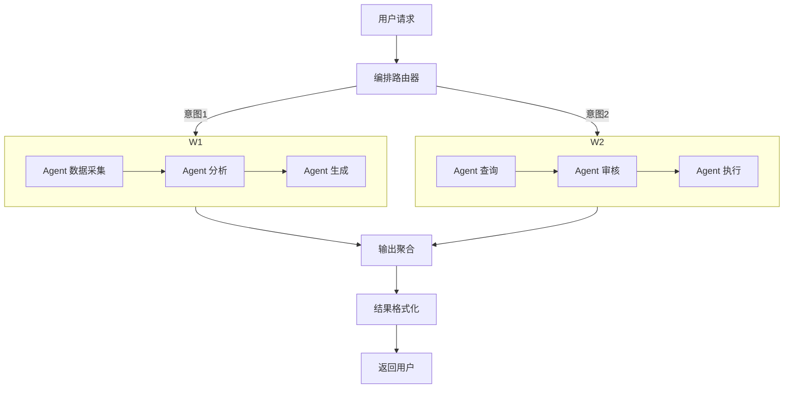

# 概念：Agent 编排

## 定义

Agent 编排（Orchestration）是指组织、协调、管理多个 Agent 协同工作的工程方法。当 AI 从单点问答走向企业级自动化时，核心不再是单个模型的能力，而是如何让多个 Agent 有序协作、管理状态、分配资源和处理异常。

## 四大编排维度

### 1️⃣ 任务编排（Task Orchestration）

企业场景中的任务通常是多步骤的组合：

| 模式 | 说明 | 场景示例 |
|------|------|---------|
| **串行编排** | Agent A output → Agent B input | 数据清洗 → 分析 → 报告 |
| **并行编排** | 多个 Agent 同时执行 | 同时查询多数据源 |
| **条件路由** | 根据结果动态选择下一步 | QA Agent → 通过/失败分支 |
| **循环迭代** | 反复执行直到条件满足 | 代码生成 → 测试 → 修复 |
| **人机协同** | Agent 执行 + 人工审批 | 自动生成合同 → 法务审批 |

### 2️⃣ 状态编排（State Orchestration）

跨会话、跨任务维护状态：

- **Session State** — 当前会话上下文
- **Task Queue** — 任务队列管理
- **Memory** — 长期记忆持久化
- **Orchestrator** — 统一协调
- **Context Manager** — 上下文管理
- **Error Handler** — 异常处理

### 3️⃣ 工具编排（Tool Orchestration）

多 Agent 共享工具资源的管理：

- **权限管理** — 不同 Agent 拥有不同访问权限
- **工具注册** — 动态注册和发现工具
- **速率限制** — 避免 API 调用过载
- **故障转移** — 工具不可用时的降级方案

### 4️⃣ 上下文编排（Context Orchestration）

多 Agent 间的信息管理：

- 上下文窗口管理
- 长期记忆与短期记忆分离
- 多 Agent 间的上下文共享与隔离
- 关键信息外置存储（不塞在 LLM 上下文里）

## 编排架构参考

## 编排框架对比

| 框架 | 编排方式 | 适用场景 | 学习成本 |
|------|---------|---------|---------|
| LangGraph | 图编排（DAG） | 复杂多步流程 | 中 |
| Dify / Coze | 可视化 Workflow | 低代码企业场景 | 低 |
| Anthropic Managed Agents | 托管式编排 | 长期运行 Agent | 中 |
| Semantic Kernel | 编排管道 | .NET 生态 | 中 |

## 企业落地挑战

### 技术挑战
- **可观测性** — Agent 决策过程难以追踪
- **可靠性** — LLM 不确定性导致输出不稳定
- **成本控制** — Token 消耗在企业规模下迅速膨胀
- **延迟管理** — 多 Agent 串联调用叠加延迟

### 工程挑战
- **状态持久化** — Agent 会话状态的可靠存储
- **并发控制** — 大量 Agent 同时运行的资源争抢
- **版本管理** — Agent 行为的迭代与回滚
- **测试验证** — 如何自动化测试 Agent 行为

## 渐进式落地路径

1. **先单 Agent** 跑通一个场景
2. **再扩展到多 Agent** 协作
3. **最后建立统一编排平台**

编排是 [[concepts/概念_ManagedAgents|Managed Agents]] 中 Harness 思想在宏观层面的扩展——从约束单个 Agent 到协调一群 Agent。

## 关联页面

- [[concepts/概念_ManagedAgents|Managed Agents]]
- [[concepts/概念_Agent架构模式|Agent 架构模式]]
- [[concepts/概念_Harness工程|Harness Engineering]]
- [[concepts/概念_上下文工程|上下文工程]]
- [[concepts/概念_AI_Agent|AI Agent]]
- [[sources/来源_企业Agent编排|来源：企业 Agent 编排]]
