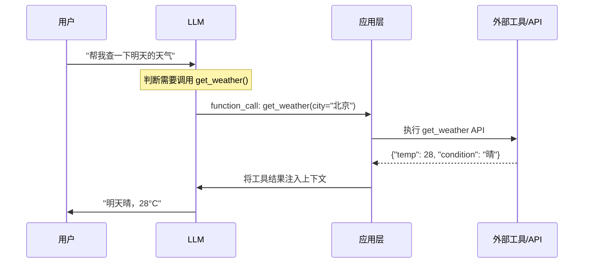

# 概念：Function Calling

## 定义

Function Calling（函数调用/工具调用）是指 LLM 根据用户请求，自动决定调用哪些预定义的函数/工具，并生成合法的参数 JSON，再由应用层执行这些函数并将结果返回给 LLM 继续推理的机制。

## 工作流程



## OpenAI vs Anthropic 对比

| 特性 | OpenAI | Anthropic Claude |
|------|--------|------------------|
| 接口名 | `function_call` / `tool_calls` | `tool_use` / `tool_result` |
| Schema 格式 | JSON Schema (OpenAPI) | JSON Schema |
| 并行工具调用 | ✅ | ✅ |
| 工具描述要求 | 中 | 高（Claude 对 description 更敏感） |
| MCP 支持 | 第三方 | 原生支持 |
| extended thinking | reasoning_effort 参数 | ✅ 内置 |

## 常见翻车场景与解法

### 1️⃣ 参数生成错误

**表现**：参数格式不对、缺少必填字段、类型错误。
**解法**：description 写清使用场景 + 格式约束 + 必填指引。

### 2️⃣ 工具选择错误

**表现**：应该调用工具 A，LLM 却选了工具 B。
**解法**：工具名称差异化，description 区分使用场景，写清"什么情况下不要用"。

### 3️⃣ 循环调用

**表现**：Agent 反复调用同一个工具陷入死循环。
**解法**：设置 max_turns，工具返回结果中附带明确的后续建议。

### 4️⃣ 上下文污染

**表现**：工具调用的中间结果占满上下文窗口。
**解法**：工具结果摘要化、分层记忆、上下文裁剪。

### 5️⃣ 工具描述过于简单

**表现**：LLM 不知道什么时候该用某个工具。
**解法**：写清楚使用场景 + 排除场景 + 参数约束。

## 工具 Schema 最佳实践

```json
{
  "name": "query_order_status",
  "description": "查询订单当前状态。当用户问'我的订单到哪了'时使用。
    如果用户问退款，请使用 query_refund_status。",
  "parameters": {
    "type": "object",
    "properties": {
      "order_id": {
        "type": "string",
        "description": "订单号，格式如 ORD-2026-0001"
      }
    },
    "required": ["order_id"]
  }
}
```

## 快速排查 Checklist

- □ 工具 description 是否写清楚使用场景？
- □ 参数 description 是否写明格式约束？
- □ 工具名称是否和同类工具区分度够高？
- □ 是否设置了最大调用轮次？
- □ 错误信息是否回传给了 LLM？
- □ 上下文是否被中间结果污染？

## 演进方向：MCP 协议

MCP（Model Context Protocol）解决了传统 Function Calling 的痛点：
- **动态发现** — 不用硬编码所有工具
- **标准化** — 工具描述格式统一
- **安全传输** — OAuth token 在 Vault 中
- **去中心化** — 不同工具部署在不同 Server

详见 [[concepts/概念_工具调用]]

## 关联页面

- [[concepts/概念_工具调用|工具调用与执行]] — 工具调用的整体框架
- [[concepts/概念_ManagedAgents|Managed Agents]] — 安全沙箱设计
- [[concepts/概念_Harness工程|Harness Engineering]] — Checkpoint 与验证
- [[concepts/概念_Skill系统|Skill 系统]] — Skill 与 Function Calling 的关系
- [[sources/来源_FunctionCalling|来源：Function Calling]]
