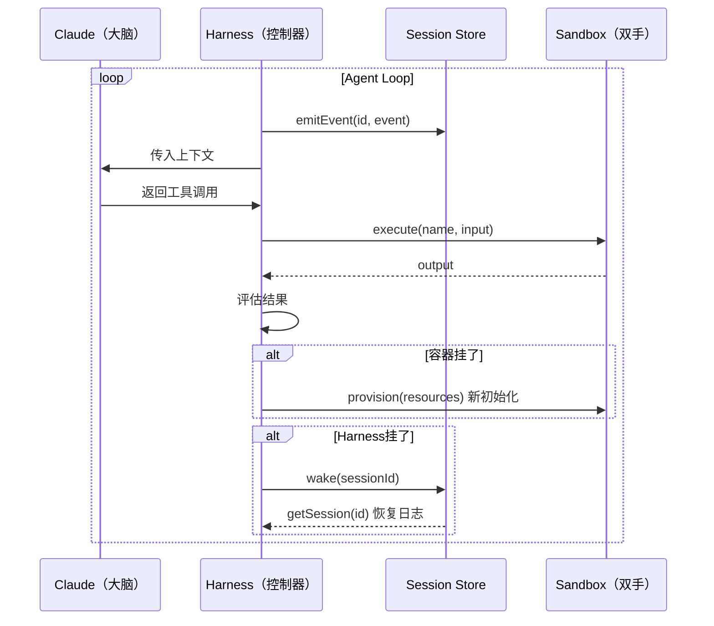

# 概念：Managed Agents 架构

## 定义

Managed Agents 是 Anthropic 于 2026 年 4 月发布的 Claude 全托管 Agent 平台架构。它通过**大脑与双手解耦**，将 Agent 拆分为 Session（会话层）、Harness（控制器）和 Sandbox（沙箱执行层）三个独立组件，实现比单体 Agent 更高的可靠性和安全性。

## 三大核心抽象

### Session（会话层）
- **不是** Claude 的上下文窗口，而是独立于上下文窗口的**持久化事件日志**
- 可追加、可时间回溯（支持快进、回退、重新阅读）
- 任何被压缩/裁剪的上下文都可以从 Session 恢复
- 本质是 Agent 专属的"事件溯源数据库"

### Harness（控制器）
- 负责调用 Claude 的循环
- 路由工具调用
- 管理上下文窗口
- 捕获错误并决定重试策略

### Sandbox（沙箱执行层）
- 隔离的代码执行环境
- 文件编辑能力
- 零信任安全边界

## 解耦架构的工作流程

## 从耦合到解耦

### 原方案（耦合）的问题
- 所有组件塞进一个容器，"宠物"式服务（Pet），挂了就丢
- 容器挂了 → Session 丢失 → 无法调试
- Prompt Injection 可直通凭据
- 客户想连 VPC 需对等网络或自运行 Harness

### 解耦后的优势
- **容器死亡** → Harness 捕获错误 → Claude 决定重试 → 新容器初始化
- **Harness 死亡** → 从 Session 日志恢复，继续执行
- **安全边界**：凭据永远不在沙箱中暴露
- **独立演进**：组件可独立替换和升级

## 安全设计亮点

- **凭据绑定资源** — Git token 在沙箱初始化时注入，Agent 从不直接操作
- **MCP 代理** — OAuth token 存在安全 Vault，Harness 不知晓凭据内容
- **零信任沙箱** — Prompt Injection 也无法访问沙箱外的凭据

## 多 Agent 协作模式

基于 Managed Agents 的协作：一个 Claude Manager 管理多个 Agent，每个 Agent 有独立 Session，共享 Session Store、知识库和工具集。

## 架构演进的启示

这套架构代表了 2026 年 Agent 工程的范式转变：

| 转变 | 从 | 到 |
|------|----|----|
| 架构风格 | 单体 | 解耦 |
| 运维模式 | "宠物"（Pet） | "牲畜"（Cattle） |
| Session 定位 | 上下文窗口附属 | 独立事件存储 |
| 安全模型 | 凭据在 Agent 内 | 凭据与逻辑分离 |

## 关联页面

- [[concepts/概念_Agent架构模式|Agent 架构模式]]
- [[concepts/概念_AI_Agent|AI Agent]]
- [[concepts/概念_工具调用|工具调用与执行]]
- [[concepts/概念_Agent记忆|Agent 记忆]]
- [[concepts/概念_上下文工程|上下文工程]]
- [[sources/来源_ManagedAgents|来源：Managed Agents]]
