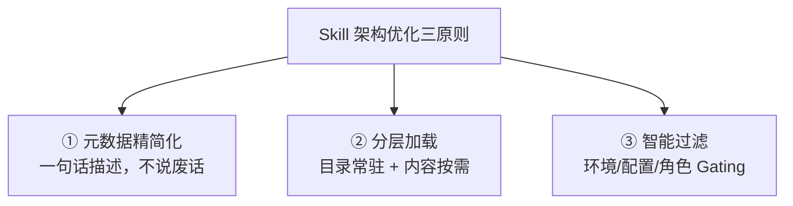

# 概念：Skill 系统

## 定义

Skill（技能）是 Agent 的能力扩展单元，本质上是将固定流程、工具调用和领域知识封装为可复用的标准模块。Skill / SOP 封装解决的是"让 Agent 稳定地做好特定事情"的问题——把经验固化为可执行的流程。

## Skill vs SOP

| 维度 | Skill | SOP |
|------|-------|-----|
| 粒度 | 单个能力单元 | 一组 Skill 编排的流程 |
| 用途 | 封装特定操作（发邮件、搜网页） | 封装业务流程（日报生成、客服响应） |
| 状态 | 可独立安装/卸载 | 多个 Skill 的组合执行 |
| 类比 | 函数 | 函数组合 |

## Skill 的构成

一个最小 Skill 只需一个目录加一个 `SKILL.md` 文件：

```
my-skill/
├── SKILL.md           # 必须。核心定义文件
├── scripts/           # 可选。辅助脚本
├── templates/         # 可选。模板文件
└── README.md          # 可选。说明文档
```

### SKILL.md 格式

```markdown
# My Custom Skill

## Description
帮助用户进行每日工作汇总，生成结构化的日报。

## Trigger
当用户提到「日报」「工作总结」「今日汇报」时激活。

## Instructions
1. 询问用户今天完成了哪些工作
2. 按项目分类整理
3. 标注每项工作的状态（已完成 / 进行中 / 阻塞）
4. 生成 Markdown 格式的日报
5. 保存到 ~/reports/YYYY-MM-DD.md

## Environment Variables
- REPORTS_DIR: 日报存储目录（默认 ~/reports）

## Tools Required
- file_write
- memory_search
```

## 三层加载优先级

| 优先级 | 位置 | 生效范围 | 说明 |
|--------|------|---------|------|
| 最高 | `<workspace>/skills/` | 当前工作区 | 项目级，可覆盖内置 Skill |
| 中 | `~/.openclaw/skills/` | 全局生效 | 用户级，ClawHub 安装的在此 |
| 最低 | bundled skills | 全局生效 | 内置 55 个 Skill，随版本发布 |

同名 Skill 高优先级覆盖低优先级，可在 workspace 级别重写内置 Skill 而不影响其他项目。

## Skill 加载流程

1. **读取元数据** → 扫描三层目录，解析 `SKILL.md`
2. **注入环境变量** → 从配置中注入 API Key 等，缺失则静默跳过
3. **构建 System Prompt** → 将所有可用 Skill 的描述注入 prompt，告知模型当前能力
4. **执行与恢复** → Skill 执行完毕后恢复原始环境变量和上下文状态

## Self-Extending Agent（自我扩展）

OpenClaw 的 Agent 可以在运行时创建、修改和重载自己的 Skill，这是它看起来"更聪明"的关键原因：

- 遇到不会的操作 → **写一个 Skill 来完成**
- 发现 Skill 有 bug → **修改并重载**
- 在循环中持续改进自己的工具链

这要求 Agent 配备强模型（如 Claude Opus），因为从零编写 Skill 比调用预构建工具需要更强的能力。

## ClawHub 技能市场

- **规模**：13,729 个注册技能
- **质量**：超过 50% 为垃圾/重复/低质量，800+ 被标记为恶意
- **精选**：awesome-openclaw-skills 从 13,729 个中选出 5,494 个
- **热门分类**：编码 Agent（1,222）、Web 开发（938）、DevOps（408）、搜索（350）

## 大规模 Skill 管理的挑战

当 Skill 数量增长到上百个时，所有元数据塞进 System Prompt 会导致上下文窗口被占满，AI 反而变笨。

### Skill 架构优化的三原则



### 1️⃣ 元数据瘦身（Metadata Diet）

| 优化点 | 做法 | Token 节省 |
|--------|------|-----------|
| description 精简 | 只写触发场景，不写具体操作 | 60-80% |
| 去掉冗余字段 | 只保留 name + description + triggers | 20-30% |
| 统一分类前缀 | 如 `git:`、`docker:` 分组 | 10-15% |
| triggers 聚合 | 同类 triggers 写到 Description | 5-10% |

### 2️⃣ 分层加载（Layered Loading）

核心思想：上下文只放 Skill 的"目录"（索引），详细内容按需加载。

```
第一层（常驻上下文） 每行 < 20 Token, 100 个 ≈ 2,000 Token
├── Skill A: 处理 Git 相关操作
├── Skill B: 处理 Docker 部署
└── ...

第二层（按需加载） AI 判断需要时才加载
├── Skill A 完整 SKILL.md 内容
└── Skill C 完整 SKILL.md 内容
```

### 3️⃣ Skill Gating（过滤机制）

根据环境条件提前过滤不可用的 Skill，减少进入上下文的 Skill 数量：

| 条件 | 示例 |
|------|------|
| 操作系统 | `requires.os: "linux"` |
| 工具存在 | `requires.bins: ["docker", "kubectl"]` |
| 环境变量 | `requires.env: ["AWS_PROFILE"]` |
| 配置项 | `requires.config: ["git.enabled"]` |
| 用户角色 | `requires.role: "admin"` |

### 优化前后对比

| 维度 | 优化前 | 优化后 |
|------|--------|--------|
| Context Window 占用 | ~30,000+ Token | ~2,000 Token（索引） |
| AI 响应质量 | 下降 | 提升 |
| 新增 Skill 成本 | 高 | 低 |
| 匹配准确率 | 低 | 高（Gating 过滤） |

## 实用建议

- 不要一次性安装太多 Skills，每个 Skill 都会增加 system prompt 长度
- 从真正需要的 3-5 个开始，用熟了再逐步扩展
- 安装第三方 Skill 前务必查看源码（ClawHub 质量参差不齐）
- 大规模部署时务必实施分层加载 + Gating 机制
- Agent 自己编写的 Skill 应保存在 workspace 级目录

## 关联页面

- [[concepts/概念_工具调用|工具调用与执行]]
- [[concepts/概念_AI_Agent|AI Agent]]
- [[concepts/概念_上下文工程|上下文工程]]
- [[entities/项目_OpenClaw|OpenClaw 项目]]
- [[sources/来源_OpenClaw橙皮书|来源：OpenClaw橙皮书]]
