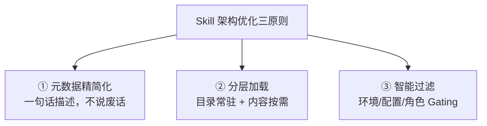

# 概念：Skill 系统

## 定义

Skill（技能）是 Agent 的能力扩展单元，本质上是将固定流程、工具调用和领域知识封装为可复用的标准模块。Skill / SOP 封装解决的是"让 Agent 稳定地做好特定事情"的问题——把经验固化为可执行的流程。

## Skill vs SOP

| 维度 | Skill | SOP |
|------|-------|-----|
| 粒度 | 单个能力单元 | 一组 Skill 编排的流程 |
| 用途 | 封装特定操作（发邮件、搜网页） | 封装业务流程（日报生成、客服响应） |
| 状态 | 可独立安装/卸载 | 多个 Skill 的组合执行 |
| 类比 | 函数 | 函数组合 |

## Skill 的构成

一个最小 Skill 只需一个目录加一个 `SKILL.md` 文件：

```
my-skill/
├── SKILL.md           # 必须。核心定义文件
├── scripts/           # 可选。辅助脚本
├── templates/         # 可选。模板文件
└── README.md          # 可选。说明文档
```

### SKILL.md 格式

```markdown
# My Custom Skill

## Description
帮助用户进行每日工作汇总，生成结构化的日报。

## Trigger
当用户提到「日报」「工作总结」「今日汇报」时激活。

## Instructions
1. 询问用户今天完成了哪些工作
2. 按项目分类整理
3. 标注每项工作的状态（已完成 / 进行中 / 阻塞）
4. 生成 Markdown 格式的日报
5. 保存到 ~/reports/YYYY-MM-DD.md

## Environment Variables
- REPORTS_DIR: 日报存储目录（默认 ~/reports）

## Tools Required
- file_write
- memory_search
```

## 三层加载优先级

| 优先级 | 位置 | 生效范围 | 说明 |
|--------|------|---------|------|
| 最高 | `<workspace>/skills/` | 当前工作区 | 项目级，可覆盖内置 Skill |
| 中 | `~/.openclaw/skills/` | 全局生效 | 用户级，ClawHub 安装的在此 |
| 最低 | bundled skills | 全局生效 | 内置 55 个 Skill，随版本发布 |

同名 Skill 高优先级覆盖低优先级，可在 workspace 级别重写内置 Skill 而不影响其他项目。

## Skill 加载流程

1. **读取元数据** → 扫描三层目录，解析 `SKILL.md`
2. **注入环境变量** → 从配置中注入 API Key 等，缺失则静默跳过
3. **构建 System Prompt** → 将所有可用 Skill 的描述注入 prompt，告知模型当前能力
4. **执行与恢复** → Skill 执行完毕后恢复原始环境变量和上下文状态

## Self-Extending Agent（自我扩展）

OpenClaw 的 Agent 可以在运行时创建、修改和重载自己的 Skill，这是它看起来"更聪明"的关键原因：

- 遇到不会的操作 → **写一个 Skill 来完成**
- 发现 Skill 有 bug → **修改并重载**
- 在循环中持续改进自己的工具链

这要求 Agent 配备强模型（如 Claude Opus），因为从零编写 Skill 比调用预构建工具需要更强的能力。

## ClawHub 技能市场

- **规模**：13,729 个注册技能
- **质量**：超过 50% 为垃圾/重复/低质量，800+ 被标记为恶意
- **精选**：awesome-openclaw-skills 从 13,729 个中选出 5,494 个
- **热门分类**：编码 Agent（1,222）、Web 开发（938）、DevOps（408）、搜索（350）

## 大规模 Skill 管理的挑战

当 Skill 数量增长到上百个时，所有元数据塞进 System Prompt 会导致上下文窗口被占满，AI 反而变笨。

### Skill 架构优化的三原则



### 1️⃣ 元数据瘦身（Metadata Diet）

| 优化点 | 做法 | Token 节省 |
|--------|------|-----------|
| description 精简 | 只写触发场景，不写具体操作 | 60-80% |
| 去掉冗余字段 | 只保留 name + description + triggers | 20-30% |
| 统一分类前缀 | 如 `git:`、`docker:` 分组 | 10-15% |
| triggers 聚合 | 同类 triggers 写到 Description | 5-10% |

### 2️⃣ 分层加载（Layered Loading）

核心思想：上下文只放 Skill 的"目录"（索引），详细内容按需加载。

```
第一层（常驻上下文） 每行 < 20 Token, 100 个 ≈ 2,000 Token
├── Skill A: 处理 Git 相关操作
├── Skill B: 处理 Docker 部署
└── ...

第二层（按需加载） AI 判断需要时才加载
├── Skill A 完整 SKILL.md 内容
└── Skill C 完整 SKILL.md 内容
```

### 3️⃣ Skill Gating（过滤机制）

根据环境条件提前过滤不可用的 Skill，减少进入上下文的 Skill 数量：

| 条件 | 示例 |
|------|------|
| 操作系统 | `requires.os: "linux"` |
| 工具存在 | `requires.bins: ["docker", "kubectl"]` |
| 环境变量 | `requires.env: ["AWS_PROFILE"]` |
| 配置项 | `requires.config: ["git.enabled"]` |
| 用户角色 | `requires.role: "admin"` |

### 优化前后对比

| 维度 | 优化前 | 优化后 |
|------|--------|--------|
| Context Window 占用 | ~30,000+ Token | ~2,000 Token（索引） |
| AI 响应质量 | 下降 | 提升 |
| 新增 Skill 成本 | 高 | 低 |
| 匹配准确率 | 低 | 高（Gating 过滤） |

## 实用建议

- 不要一次性安装太多 Skills，每个 Skill 都会增加 system prompt 长度
- 从真正需要的 3-5 个开始，用熟了再逐步扩展
- 安装第三方 Skill 前务必查看源码（ClawHub 质量参差不齐）
- 大规模部署时务必实施分层加载 + Gating 机制
- Agent 自己编写的 Skill 应保存在 workspace 级目录

## Self-Improving Skills（Hermes 模式）

Hermes Agent 实现了 Skill 的自我进化——Agent 不再依赖手写，而是从工作经验中自动提炼 Skill。

### 自动创建

- **触发阈值**：工具调用超过 5 次才值得创建 Skill，简单任务不记
- **创建时机**：踩过坑再修复的经验、用户纠正过的做法、非平凡工作流
- **内容来源**：Agent 实际执行过程中的步骤、错误修复、踩坑经验

### 自我修补（Self-Patching）

当 Agent 按照已有 Skill 执行但发现步骤遗漏或踩了新坑时，自动修补 Skill：

1. `fuzzy_find_and_replace` 做模糊匹配局部 patch
2. `_security_scan_skill()` 安全扫描验证
3. 不通过则自动回滚到原始内容
4. Agent 在踩完坑的当场就把 Pitfalls 补上

### 渐进式加载

区别于 OpenClaw 的"重型背包"模式（全量塞入上下文），Hermes 采用"动态图书馆"模式：

- **第一层（常驻上下文）**：仅放轻量索引（Skill 名 + 一句话描述），100 个 Skill ≈ 2,000 Token
- **第二层（按需加载）**：Agent 判断某个 Skill 跟当前任务相关时，才通过 skill_view 加载完整内容

### MCP + Skill 组合模式

得物技术的 `/log-diagnosis` Skill 展示了另一种 Skill 使用模式：

> **"MCP 给数据，Skill 给流程"** — 协议层（MCP）解决数据获取问题，规范层（Skill）解决分析流程问题

Skill 工作流：traceId → 分页日志拉取 → 代码检索 → 根因分析 → 诊断报告。这证明 Skill 不仅可以封装固定操作流程，还可以编排 MCP 工具的调用序列。

### 设计哲学分野

| 维度 | OpenClaw | Hermes Agent |
|------|----------|--------------|
| Skill 创建 | 手写或社区装 | 自动从经验创建（5+ 调用触发） |
| Memory | 纯追加，无限膨胀 | 容量上限 + 自动压缩 |
| Skill 加载 | 全量塞入上下文 | 渐进式按需加载 |
| 学习能力 | 不会从工作中学到东西 | 每次踩坑都在加固 |
| 维护方式 | 手动更新 | `fuzzy_find_and_replace` 自动 patch |

## Perplexity Skill 设计六步框架

Perplexity 官方论文《Designing, Refining, and Maintaining Agent Skills at Perplexity》提出了完整的 Skill 设计方法论，核心思想是 **"每个 Skill 都要收上下文税，必须让收益大于税收"**。

### ① 理解本质：Context Packaging

> ❌ 误区：Skill = 把文档放进 prompt
> ✅ 正确定义：Skill = 面向模型的运行时上下文模块

传统系统与 Agent 系统的映射：

| 传统系统 | Agent 系统 |
|---------|-----------|
| Function = 能力 | Skill = 能力载体 |
| Module = 代码组织 | Context = 资源 |
| API Route = 接口 | Description = Router |
| Unit Test = 质量保障 | Eval = 行为保障 |

### ② 从 Prompt Engineering 到 Context Engineering

传统一次性塞进 System Prompt 导致 Context 膨胀、Attention 分散、指令冲突。Context Engineering 的思想是：**上下文应该像内存一样被管理。**

### ③ Progressive Loading（渐进式加载）

三层加载架构：

```
第一层：Skill Index           (< 100 tokens)
├── name, description
└── 作用：Skill Routing（决定是否加载）

第二层：SKILL.md              (~ 5000 tokens)
├── 工作流、约束、Gotchas、示例
└── 作用：真正加载时读取核心规则

第三层：Heavy Assets           (按需读取)
├── references/、examples/、assets/
└── 作用：不会一开始进入上下文
```

### ④ Description = Router（最重要的一句话）

- ❌ 错误写法：`This skill helps with React UI.`（面向人，描述功能）
- ✅ 正确写法：`Load when user asks for dashboard-style React admin UI.`（面向路由，描述触发条件）

### ⑤ Skill Tree：分层路由

反面案例：1945 个税法 Skill 平铺 → 路由效果极差。解决方案是像 B-Tree 一样分层（Federal / State / International）。**模型无法稳定从大量候选中选择，必须分层检索、多级召回。**

### ⑥ Gotchas > 流程

> **模型通常知道流程，但不知道坑。**

反例/Gotchas（"不要修改 migration 文件"、"先 dry-run"、"不要覆盖 generated code"）直接决定稳定性、安全性和工程正确性。

### Eval-Driven Development

Skill 开发第一步不是写 Skill，是先写 Eval：

| Eval 类型 | 作用 |
|-----------|------|
| Routing Eval | 是否正确加载 |
| File Read Eval | 是否读取正确文件 |
| Progressive Loading Eval | 是否按需加载 |
| End-to-End Eval | 最终任务质量 |

### Append-Mostly 维护

Skill 不是频繁改规则，而是**持续追加失败经验**。每次踩坑就追加一条 Gotcha——这与 OpenClaw self-improving 和 Hermes Agent 的 self-patching 一脉相承。

### 与 OpenClaw 的对齐

| Perplexity | OpenClaw |
|-----------|---------|
| Skill Index | ClawHub skill 注册 |
| Progressive Loading | skill 按需注入 |
| Append-Mostly | self-improving skill learnings |
| Description is Router | skill trigger 设计 |

## Claude Code Skills 工程实践

基于 Claude Code 实战系列的 Skill 工程设计专项：

- [[concepts/概念_渐进式披露|渐进式披露]] — 三层加载模型与 budget 预算机制
- [[concepts/概念_Skill触发机制|Skill 触发机制]] — 双通道激活、description 设计、参考型 vs 任务型
- [[concepts/概念_Skill工程设计|Skill 工程设计]] — 目录规范、元数据、路由器思维、500行法则、作用域与优先级
- [[concepts/概念_Skill动态上下文|Skill 动态上下文]] — $ARGUMENTS 变量与 !`command` 动态 Shell 注入
- [[concepts/概念_Skill设计模式|Skill 设计模式]] — 模板驱动、脚本增强、知识分层、工具隔离
- [[concepts/概念_Skill实战案例|Skill 实战案例]] — 代码审查 Skill + 智能提交 Skill
- [[concepts/概念_Skill测试与迭代|Skill 测试与迭代]] — 触发/功能/性能三类测试与迭代闭环
- [[concepts/概念_Skill与软件工程|Skill 与软件工程]] — 五大软件工程原则映射

## 关联页面

- [[concepts/概念_工具调用|工具调用与执行]]
- [[concepts/概念_AI_Agent|AI Agent]]
- [[concepts/概念_上下文工程|上下文工程]]
- [[concepts/概念_FunctionCalling|Function Calling]]
- [[comparisons/ClaudeMD_vs_Skills|Claude.md vs Skills]]
- [[entities/项目_ClaudeCode|Claude Code 项目]]
- [[entities/项目_OpenClaw|OpenClaw 项目]]
- [[entities/项目_HermesAgent|Hermes Agent 项目]]
- [[sources/来源_OpenClaw橙皮书|来源：OpenClaw橙皮书]]
- [[sources/来源_HermesAgent|来源：Hermes Agent Self-Improving]]
- [[sources/来源_日志诊断Skill|来源：日志诊断 Skill]]
- [[sources/来源_ClaudeCode实战_Skills工程实践|来源：Claude Code Skills 工程实践]]
