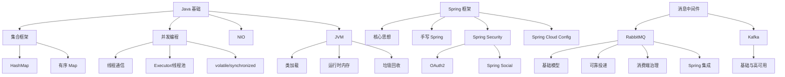

# 主题：Java 后端技术栈综述

## 一句话结论

这批 `raw/笔记` 资料可以组织成三层知识结构：[[entities/技术_Java|Java]] 语言与运行时基础、[[entities/技术_Spring|Spring]] 应用框架、[[entities/技术_RabbitMQ|RabbitMQ]]/[[entities/技术_Kafka|Kafka]] 消息中间件。

## 总体框架

## 主线一：Java 基础

- [[concepts/概念_Java集合框架|Java 集合框架]] 是容器基础，进一步拆到 [[concepts/概念_HashMap|HashMap]] 和 [[concepts/概念_有序Map|有序 Map]]。
- [[concepts/概念_Java并发基础|Java 并发基础]] 覆盖线程生命周期，并连接到 [[concepts/概念_Java线程通信|线程通信]]、[[concepts/概念_volatile|volatile]]、[[concepts/概念_synchronized|synchronized]]、[[concepts/概念_Executor框架|Executor 框架]] 和 [[concepts/概念_Java线程池|线程池]]。
- [[concepts/概念_Java_NIO|Java NIO]] 补充后端网络 IO 基础。
- JVM 主线由 [[concepts/概念_JVM类加载|JVM 类加载]]、[[concepts/概念_JVM运行时内存|JVM 运行时内存]] 和 [[concepts/概念_Java垃圾回收|Java 垃圾回收]] 组成。

## 主线二：Spring 框架

- [[concepts/概念_Spring核心思想|Spring 核心思想]] 解释 IoC、DI、AOP 和模块体系。
- [[concepts/概念_手写Spring框架|手写 Spring 框架]] 用简化实现串联 IoC/DI/MVC 的执行流程。
- [[concepts/概念_SpringSecurity|Spring Security]] 通过过滤器链和拦截器组织认证授权，并连接 [[concepts/概念_OAuth2|OAuth2]] 和 [[concepts/概念_SpringSocial|Spring Social]]。
- [[concepts/概念_SpringCloudConfig|Spring Cloud Config]] 作为微服务集中配置组件补充 Spring Cloud 方向。

## 主线三：消息中间件

- [[concepts/概念_RabbitMQ基础模型|RabbitMQ 基础模型]] 建立 AMQP 消息流转概念。
- [[concepts/概念_RabbitMQ可靠性投递|RabbitMQ 可靠性投递]] 与 [[concepts/概念_RabbitMQ消费端治理|RabbitMQ 消费端治理]] 分别处理生产端和消费端质量问题。
- [[concepts/概念_RabbitMQ与Spring集成|RabbitMQ 与 Spring 集成]] 将 RabbitMQ 接入 Spring 工程实践。
- [[concepts/概念_Kafka基础与高可用|Kafka 基础与高可用]] 补充 Kafka 的分区、副本、索引和消费组模型。

## 未处理或低价值来源

- `raw/笔记` 中的空 Markdown/TXT 文件未创建单独页面。
- `target/`、`out/`、`bin/`、`src/` 等源码或构建产物只作为原始资产保留，未逐文件转写。
- xmind、vsdx、图片等二进制资料本轮未解析为独立页面，仅在相关主题中保留来源上下文。

## 关联来源

- [[sources/来源_Java集合框架笔记|Java 集合框架笔记]]
- [[sources/来源_Java并发编程笔记|Java 并发编程笔记]]
- [[sources/来源_Java_NIO笔记|Java NIO 笔记]]
- [[sources/来源_JVM笔记|JVM 笔记]]
- [[sources/来源_Spring编程与手写框架笔记|Spring 编程与手写框架笔记]]
- [[sources/来源_SpringSecurity与OAuth笔记|Spring Security 与 OAuth 笔记]]
- [[sources/来源_SpringCloudConfig笔记|Spring Cloud Config 笔记]]
- [[sources/来源_RabbitMQ笔记|RabbitMQ 笔记]]
- [[sources/来源_Kafka面试题|Kafka 面试题]]

