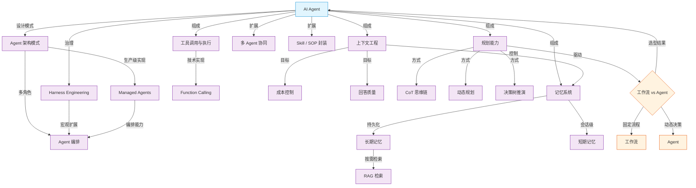
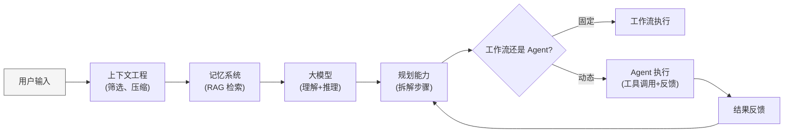

# 知识图谱：AI Agent 知识体系

## 全景图

## 概念关系详解

### 核心与组件

| 关系 | 说明 | 涉及页面 |
|------|------|---------|
| **AI Agent → 记忆系统** | Agent 使用记忆系统持久化保存上下文，实现跨会话连续性 | [[concepts/概念_AI_Agent]] → [[concepts/概念_Agent记忆]] |
| **AI Agent → 上下文工程** | Agent 通过上下文工程决定哪些信息送入模型，控制成本和质量 | [[concepts/概念_AI_Agent]] → [[concepts/概念_上下文工程]] |
| **AI Agent → 规划能力** | Agent 利用规划能力将目标拆解为步骤，动态调整执行路径 | [[concepts/概念_AI_Agent]] → [[concepts/概念_Agent规划能力]] |
| **AI Agent → 工具调用** | Agent 通过工具调用将决策落地为实际操作，核心工具集为 Read/Write/Edit/Bash | [[concepts/概念_AI_Agent]] → [[concepts/概念_工具调用]] |
| **AI Agent → 工作流选型** | 固定流程用工作流，动态决策用 Agent，避免过度设计 | [[concepts/概念_AI_Agent]] → [[comparisons/工作流_vs_Agent]] |

### 组件间依赖

| 关系 | 说明 |
|------|------|
| **上下文工程 → 记忆系统** | 上下文工程决定记忆信息如何加载、压缩、归档。二者是"管"与"存"的关系 |
| **规划能力 → 工作流/Agent 选型** | 规划能力的复杂度决定了采用工作流还是 Agent：简单线性任务走工作流，需要动态拆解和修正的上 Agent |
| **记忆系统 → 上下文工程** | 长期记忆的检索结果是上下文工程的信息来源之一 |

### 记忆系统内部

| 关系 | 说明 |
|------|------|
| **短期记忆 ↔ 长期记忆** | 短期依赖上下文窗口，长期依靠持久化存储 + RAG 检索 |
| **长期记忆 → RAG** | RAG 是实现长期记忆按需检索的核心技术 |

### 规划能力内部

| 关系 | 说明 |
|------|------|
| **CoT → 动态规划 → 决策树** | 三种规划方式复杂度递增：CoT 线性执行 → 动态规划闭环修正 → 决策树提前推演剪枝 |

## 信息流路径

一条典型的 Agent 请求在知识体系中的流转路径：

## 覆盖状态

| 模块 | 状态 | 对应页面 |
|------|------|---------|
| AI Agent 定义 | ✅ 已覆盖 | [[concepts/概念_AI_Agent]] |
| 记忆系统 | ✅ 已覆盖 | [[concepts/概念_Agent记忆]]，[[sources/来源_Agent的记忆]] |
| 上下文工程 | ✅ 已覆盖 | [[concepts/概念_上下文工程]]，[[sources/来源_上下文工程]]，[[sources/来源_CLAUDE优化指南]]，[[sources/来源_Skill架构优化]] |
| 规划能力 | ✅ 已覆盖 | [[concepts/概念_Agent规划能力]]，[[sources/来源_Agent的规划能力]] |
| 工作流 vs Agent | ✅ 已覆盖 | [[comparisons/工作流_vs_Agent]]，[[sources/来源_工作流_vs_Agent]] |
| 入门综述 | ✅ 已覆盖 | [[overview/主题_Agent入门综述]] |
| **工具调用与执行** | ✅ 已覆盖 | [[concepts/概念_工具调用]] |
| **Skill / SOP 封装** | ✅ 已覆盖 | [[concepts/概念_Skill系统]]，[[sources/来源_Skill架构优化]] |
| **Agent 架构模式** | ✅ 已覆盖 | [[concepts/概念_Agent架构模式]]，[[sources/来源_Agent的7种架构]] |
| **Managed Agents** | ✅ 已覆盖 | [[concepts/概念_ManagedAgents]]，[[sources/来源_ManagedAgents]] |
| **Entities（项目）** | ✅ 已覆盖 | [[entities/项目_OpenClaw]]，[[entities/插件_Claudian]] |
| **OpenClaw 橙皮书** | ✅ 已覆盖 | [[sources/来源_OpenClaw橙皮书]] |
| **Obsidian 攻略** | ✅ 已覆盖 | [[sources/来源_Obsidian攻略]] |
| **CLAUDE.md 优化** | ✅ 已覆盖 | [[sources/来源_CLAUDE优化指南]] |
| **多 Agent 协同** | ✅ 已覆盖 | [[concepts/概念_Agent编排]]，[[sources/来源_企业Agent编排]] |
| **Harness Engineering** | ✅ 已覆盖 | [[concepts/概念_Harness工程]]，[[sources/来源_Harness工程]] |
| **Function Calling** | ✅ 已覆盖 | [[concepts/概念_FunctionCalling]]，[[sources/来源_FunctionCalling]] |

> **🎉 知识覆盖状态：19/19，全部覆盖，无缺口。**

## 关联页面

- [[overview/主题_Agent入门综述|Agent 入门综述]] — 入门级总览，本图谱的简化版本
- [[wiki/index]] — 当前 wiki 索引
- [[TheSchema]] — 系统工作流定义
